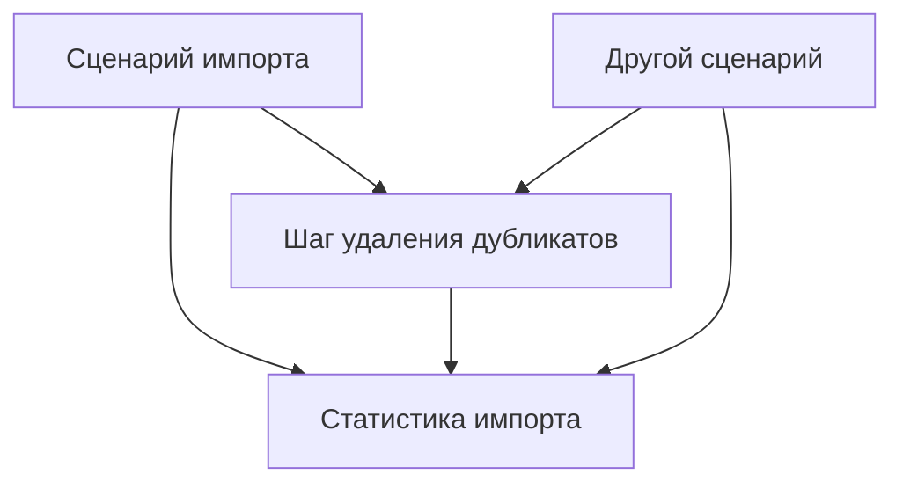
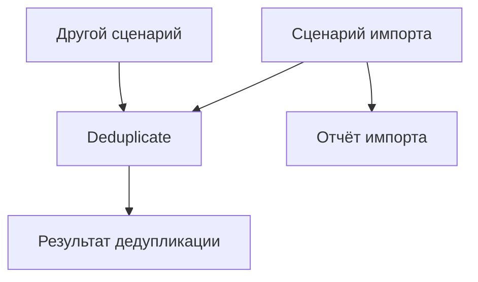

# Решаем, что код должен знать

Проектирование ПО · C#

<!--
Базовое знание C# предполагается. Сначала изложите понятие, затем объясните его на примерах. Если раздел занимает несколько слайдов, отведённое на него учебное время распределяется между ними.
-->

---

# Добавим отчётность в рабочий импорт

```csharp
var names = ReadNames(source);
var unique = RemoveDuplicates(names);
WriteNames(destination, unique);
```

Для `["Ann", "Bob", "Ann"]` записываем `["Ann", "Bob"]`.

Новое требование:

```text
Read: 3
Removed as duplicates: 1
Written: 2
```

Откуда сценарий возьмёт эти числа?

<!--
Заметки для преподавателя · 2 мин.

Повторите контракт входа/выхода из урока 1. Это одна небольшая программа; структура проекта или фреймворк конвейеров не требуются.

Считаем коллекции сразу вычисляемыми (eager), а успешное завершение записи означает, что записаны все переданные имена. Если нужно сообщать о частичных записях, потребуется более богатый контракт писателя. Не усложняйте этот пример таким сценарием.
-->

---

# Прямая реализация знакомит шаг с отчётом импорта

**Зацепление** (coupling): зависимости и допущения, связывающие разные части программы.

<div class="grid grid-cols-2 gap-6">

<div>

```csharp
IReadOnlyList<string> RemoveDuplicatesForReport(
    IReadOnlyList<string> names,
    ImportStatistics outStatistics)
{
    var unique = RemoveDuplicates(names);
    outStatistics.AddRemoved(
        names.Count - unique.Count);
    return unique;
}
```

</div>

<div>

Тип отчётности поддерживает весь сценарий:

```csharp
sealed class ImportStatistics
{
    // Шаги сценария добавляют к счётчикам;
    // сбрасывать должен только оркестратор.
    public void AddRead(int count)
    { /* накапливаем */ }
    public void AddRemoved(int count)
    { /* накапливаем */ }
    public void AddWritten(int count)
    { /* накапливаем */ }
    public void Reset() { /* сброс между запусками */ }
}
```

</div>

</div>

Шаг получает больше знаний и доступа, чем нужно для удаления дубликатов.

<!--
Заметки для преподавателя · 3 мин.

Тела методов — сокращённые наброски API; настоящая реализация накопителей — в эталонном коде. Счётчики закрыты, методы добавления отклоняют отрицательные значения. Публичных сеттеров нет.

Имя outStatistics и операция AddRemoved делают изменение явным. Не подавайте само изменение как проблему. Проблема в том, что шаг для независимого использования принимает весь тип ImportStatistics.

Комментарий сообщает об ограничении на сброс, но не обеспечивает его. Позже сравним это с более узким интерфейсом, а не будем молча делать вид, будто комментарий предотвращает злоупотребление.
-->

---

# Покажем, что позволяет лишняя зависимость

<div class="grid grid-cols-2 gap-6">

<div>

Второму сценарию нужны только уникальные имена:

```csharp
var unusedImportReport = new ImportStatistics();
var unique = RemoveDuplicatesForReport(
    names, unusedImportReport);
```

</div>

<div>

Случайное изменение внутри шага отчётности:

```csharp
// Компилируется, но стирает прежние счётчики:
outStatistics.Reset();
outStatistics.AddRemoved(removedCount);
```

</div>

</div>

Первый вызывающий вынужден создавать ненужный ему отчёт импорта. Второй фрагмент нарушает правило накопления отчёта.

<!--
Заметки для преподавателя · 2 мин.

Различайте два последствия. Повторное использование, требующее ненужного объекта, — архитектурное затруднение, а не ошибка компилятора. Сброс внутри шага — конкретная поведенческая ошибка при заявленном соглашении сценария.

Не каждая зависимость вызывает ту или иную проблему. Называйте конкретную зависимость и её последствие вместо абстрактного «зацепление — это плохо».
-->

---

# Вернём сведения о самой операции

```csharp
record DeduplicationResult(IReadOnlyList<string> Names, int RemovedCount);

DeduplicationResult Deduplicate(IReadOnlyList<string> names)
{
    var unique = RemoveDuplicates(names);
    var result = new DeduplicationResult(
        unique, names.Count - unique.Count);
    return result;
}
```

```csharp
var result = Deduplicate(new[] { "Ann", "Bob", "Ann" });
// result.Names: ["Ann", "Bob"]
// result.RemovedCount: 1
```

Результат описывает удаление дубликатов. Полей, специфичных для импорта, в нём нет.

<!--
Заметки для преподавателя · 3 мин.

Используйте подход с возвращаемым результатом в качестве основного положительного примера. RemoveDuplicates — полная реализация, уже показанная в уроке 1; Deduplicate добавляет к результату требуемые сведения.

Кортеж тоже подошёл бы. Именованный результат сохраняет объяснение понятным. IReadOnlyList ограничивает то, что потребители результата могут делать через этот вид; это не гарантия глубокой неизменяемости.

Для этой сразу вычисляемой коллекции вызывающий мог бы сам вычислить количество как разность длин. Эта более простая альтернатива корректна. Результат становится ценнее, когда несёт сведения, которые вызывающие восстановить не могут, например отдельные причины отклонения. Не требуйте результат-обёртку без такой нужды.
-->

---

# Сценарий сам строит свой отчёт

```csharp
record ImportReport(string Source, int Read, int Removed, int Written);
```

<div class="grid grid-cols-2 gap-6">

<div>

```csharp
var names = ReadNames(source);
var result = Deduplicate(names);
WriteNames(destination, result.Names);

var report = new ImportReport(
    Source: source,
    Read: names.Count,
    Removed: result.RemovedCount,
    Written: result.Names.Count);
ShowReport(report);
```

</div>

<div>

Другой вызывающий использует ту же операцию:

```csharp
var result = Deduplicate(selectedNames);
ShowNames(result.Names);
```

</div>

</div>

<!--
Заметки для преподавателя · 3 мин.

Прочитайте оба примера вызова. Сценарий импорта собирает отчёт, потому что знает источник, операцию записи и смысл полей отчёта. Другой вызывающий отчёт импорта вообще не создаёт.

Называйте оркестрацией (orchestration) расстановку вызовов и объединение их результатов. Отдельный класс-оркестратор не требуется. Сценарий закономерно зависит от используемых операций.
-->

---

# Архитектура включает решение, кто о ком знает

<div class="grid grid-cols-2 gap-6">

<div>

Нежелательное отношение:

```csharp
RemoveDuplicatesForReport(names, importStatistics);
```



</div>

<div>

Независимый результат:

```csharp
// Отчёт импорта не нужен:
var result = Deduplicate(names);
```



</div>

</div>

Стрелки показывают выбранные зависимости кода, а не порядок выполнения.

<!--
Заметки для преподавателя · 2 мин.

Вторая диаграмма для читаемости опускает зависимости вызывающих от типа результата; объясните, что оба вызывающих тоже используют его контракт. Это не утверждение, будто результаты свободны от зависимостей.

Архитектура (architecture) — значимая организация ответственностей и зависимостей. Эти решения есть даже в одном файле. Один лишь перенос по папкам не уберёт параметр ImportStatistics. Сборки смогут позже обеспечить границы; для понимания разницы они не нужны.

Сошлитесь на примеры использования с прошлого слайда и на ошибку сброса. Диаграмма должна подытожить конкретный код, который студенты уже видели.
-->

---

# Порядок вызовов бывает зависимостью

Допустим, парсер по умолчанию разбирает вход с запятыми.

<div class="grid grid-cols-2 gap-6">

<div>

Правильный порядок настройки:

```csharp
var parser = new TextParser();
parser.Separator = ';';
var values = parser.Parse("a;b"); // ["a", "b"]
```

</div>

<div>

Настройка опоздала:

```csharp
var parser = new TextParser();
var values = parser.Parse("a;b"); // ["a;b"]
parser.Separator = ';';
```

</div>

</div>

Без запоминаемой последовательности настройки:

```csharp
var values = Parse("a;b", separator: ';'); // ["a", "b"]
```

<!--
Заметки для преподавателя · 3 мин.

Простой парсер использует text.Split(Separator). Это не полный CSV-парсер. Заменяющий его помощник Parse — это text.Split(separator); обе реализации есть в эталонном коде.

Настроенный объект парсера тоже может быть уместен: new TextParser(';') устанавливает настройку до того, как экземпляр можно использовать. Предпочитайте его, когда объект владеет полезной конфигурацией для многих вызовов. Суть — показать требуемую информацию или обеспечить настройку, а не требовать один универсальный синтаксис.

Это демонстрирует зависимость от порядка вызовов, даже когда сигнатуры методов о ней молчат. Владение памятью для объяснения примера не нужно.
-->

---

# Вид «только приращение» делает изменение точнее

```csharp
interface IRemovalCounter
{
    void AddRemoved(int count);
}
```

```csharp
IReadOnlyList<string> DeduplicateAndCount(
    IReadOnlyList<string> names, IRemovalCounter outStatistics)
{
    var result = Deduplicate(names);
    outStatistics.AddRemoved(result.RemovedCount);
    // outStatistics.Reset(); // Через этот интерфейс недоступно.
    return result.Names;
}
```

Контракт разрешает добавлять к счётчикам только неотрицательные значения. Сбрасывать их объявленный интерфейс не предусматривает.

<!--
Заметки для преподавателя · 3 мин.

Это корректная альтернатива, когда отчётность по ходу операции действительно полезна. Реализация AddRemoved должна отвергать отрицательные значения, если обещано поведение «только приращение». Одно имя метода это ограничение не устанавливает.

Оркестратор может хранить экземпляр ImportStatistics, реализующий IRemovalCounter и открывающий оркестратору доступ к Reset. Шагу передаётся только узкий вид. Намеренные нисходящие приведения могут обойти ограничение интерфейса; это приём проектирования API, а не граница безопасности.

Сравните цену явно: комментарий — меньше кода, но полагается на соблюдение соглашения вызывающими; узкий интерфейс лучше описывает разрешённые операции, но добавляет ещё один тип. Возвращаемый результат остаётся простейшим главным путём.
-->

---

# Общая отчётность отдаёт толкование события наружу

Операция сообщает факт:

```csharp
record ItemsRemoved(int Count);

// Внутри операции:
context.Report(new ItemsRemoved(removedCount));
```

Сценарий решает, что факт значит для его отчёта:

```csharp
var context = new ReportingContext();
context.On<ItemsRemoved>(e => importStatistics.AddRemoved(e.Count));
var unique = DeduplicateWithReporting(names, context);
```

Другой вызывающий может пометить его иначе:

```csharp
context.On<ItemsRemoved>(e => Console.WriteLine($"Selection shortened by {e.Count}"));
```

<!--
Заметки для преподавателя · 2 мин.

ReportingContext — небольшой иллюстративный API рассылки событий, а не встроенный тип .NET. Он намеренно не оформлен как упражнение по созданию фреймворка в этом уроке. Для альтернативного вызывающего используйте отдельный контекст; фрагменты показывают разные выборы вызывающих, а не обязательно одновременные подписки.

Шаг знает ItemsRemoved — факт о собственной операции. Отчёт импорта и его поля он не знает. Это легитимное использование общего контекста, а не намеренно сломанный пример под видом корректного.

Обратные вызовы и рассылка событий усложняют понимание поведения: когда происходит отчётность и как обрабатываются сбои. Для текущей операции с одним результатом вернуть результат проще. Альтернативу полезно узнавать, а не заучивать как новый обязательный паттерн.
-->

---

# Связность спрашивает, что чему принадлежит

**Связность** (cohesion): насколько хорошо вещи внутри функции, класса или модуля подходят друг другу.

У этих значений общее правило:

```csharp
if (min > max)
    throw new ArgumentException("Bounds are reversed.");
```

Поэтому помещаем их в подходящий тип с осмысленным именем:

```csharp
var interval = Interval.Create(10, 20,
    Boundary.Inclusive, Boundary.Exclusive);
bool allowed = interval.Contains(15);
```

Границы, типы их концов и их трактовка связаны друг с другом, потому что задают один интервал.

<!--
Заметки для преподавателя · 3 мин.

Далее идут пять слайдов подряд про связность. Не объясняйте слово через другое столь же абстрактное определение. Начните с уже знакомого студентам интервала.

Вещи связаны друг с другом не случайно. Два значения принадлежат друг другу, потому что их соединяет правило. Метод принадлежит им, потому что ему нужны это правило и представление.

Связность не значит, что в каждом классе одно поле, а в каждой функции одна инструкция.
-->

---

# Две операции делят одно правило

Имена в этом индексе — ASCII-идентификаторы и должны сравниваться без учёта регистра.

```csharp
index.Add("ann".ToLowerInvariant(), 7);
index.TryGetValue("ann", out var id); // true, id равен 7
```

Теперь другой вызывающий использует верхний регистр:

```csharp
index.TryGetValue("ANN", out var id); // false: забыли нормализацию
```

Исправление только этого вызывающего оставит ту же ловушку следующему:

```csharp
index.TryGetValue(name.ToLowerInvariant(), out var id);
```

Вставка и поиск должны использовать одно правило сравнения имён.

<!--
Заметки для преподавателя · 3 мин.

Считайте index обычным чувствительным к регистру Dictionary<string,int>. Начните с успешного поиска в нижнем регистре, затем покажите неудавшийся поиск в верхнем. Требование уже установлено, поэтому false — дефект поведения, а не просто другое разумное соглашение.

Не превращайте это в урок про интернациональные имена. ASCII-идентификаторы сохраняют пример сфокусированным на сравнении.

Спросите, какое правило дублируется между вызывающими. Вынос одного лишь приведения к нижнему регистру в помощник всё равно требовал бы от вызывающих помнить о нём в каждой нужной точке.
-->

---

# Одна абстракция владеет обеими сторонами правила

```csharp
sealed class NameIndex
{
    private readonly Dictionary<string, int> _ids =
        new(StringComparer.OrdinalIgnoreCase);

    public void Add(string name, int id) => _ids.Add(name, id);
    public bool TryFind(string name, out int id)
        => _ids.TryGetValue(name, out id);
}
```

```csharp
var index = new NameIndex();
index.Add("Ann", 7);
index.TryFind("ANN", out var id); // true, id равен 7
```

Обе операции используют одно правило сравнения. Вызывающие больше не подготавливают ключи вручную.

<!--
Заметки для преподавателя · 3 мин.

Назовите контракт: эквивалентные ключи сравниваются без учёта регистра, повторные вызовы Add отклоняются, а TryFind сообщает, есть ли совпадающий ключ.

Обёртка полезна, когда устанавливает границу для нескольких потребителей. Корректно настроенный словарь внутри одной локальной функции может оказаться достаточным. Улучшение — не «каждому словарю нужна обёртка».

Это связность между операциями, а не только между полями. Инкапсуляция не даёт обычным клиентам обойти выбранное сравнение, напрямую меняя закрытый словарь.
-->

---

# Отдельные помощники оставляют общее правило каждому вызывающему

```csharp
string NormalizeKey(string name) => name.ToLowerInvariant();
void Store(Dictionary<string, int> data, string key, int id)
    => data.Add(key, id);
bool Find(Dictionary<string, int> data, string key, out int id)
    => data.TryGetValue(key, out id);
```

<div class="grid grid-cols-2 gap-6">

<div>

Вызывающий собирает их вручную:

```csharp
Store(data, NormalizeKey(name), id);
Find(data, name, out id); // Опять без NormalizeKey.
```

</div>

<div>

С общим правилом, принадлежащим индексу:

```csharp
index.Add(name, id);
index.TryFind(name, out id);
```

</div>

</div>

Само по себе увеличение числа функций лучшей границы не дало.

<!--
Заметки для преподавателя · 3 мин.

Общие помощники Store и Find могут пригодиться в другом месте. Требование к регистронезависимому индексу само по себе они не решают. Обязанность корректно нормализовать по-прежнему лежит на вызывающем.

Не утверждайте, что всякое разделение вредно. Покажите конкретное знание, которое после этого выноса осталось разбросанным. Версия NameIndex владеет отношением, которое эти места вызова раз за разом восстанавливают.
-->

---

# Одно использование данных ещё не роднит ответственности

Широкий помощник:

```csharp
void AddName(NameIndex index, string name, int id, string reportPath)
{
    index.Add(name, id);
    File.AppendAllText(reportPath, $"Added {name}\n");
}
```

Теперь каждой вставке нужно передавать путь к файлу отчёта.

<div class="grid grid-cols-2 gap-6">

<div>

Независимо полезный индекс плюс действие вызывающего:

```csharp
index.Add(name, id);
File.AppendAllText(reportPath, $"Added {name}\n");
```

</div>

<div>

Другой вызывающий просто пишет:

```csharp
index.Add(name, id);
```

</div>

</div>

Связность спрашивает, что чему принадлежит. Зацепление спрашивает, от чего зависит каждая часть.

<!--
Заметки для преподавателя · 3 мин.

Вставка и сравнение имён принадлежат друг другу из-за общего правила индекса. Вставка и запись в файл лишь случаются вместе в этом сценарии. Другой вызывающий показывает, почему различие важно.

Двухстрочный сценарий сам может заслуживать именованной функции, если это составное действие — осмысленная операция. Дайте ей имя вроде RegisterNameAndWriteAudit и подходящий контракт. Не выдавайте это за обобщённую операцию вставки в индекс.

Завершите раздел связности, попросив студентов своими словами назвать общее правило или назначение. «Оба используют строки» и «они в одном файле» группировку не оправдывают.
-->

---

# Конкретное изменение показывает, помогает ли граница

Новое требование: включить адресат в отчёт импорта.

```diff
 record ImportReport(
-    string Source, int Read, int Removed, int Written);
+    string Source, string Destination, int Read, int Removed, int Written);
```

<div class="grid grid-cols-2 gap-6">

<div>

Сценарий добавляет его:

```csharp
var report = new ImportReport(source, destination,
    names.Count, result.RemovedCount,
    result.Names.Count);
```

</div>

<div>

У удаления дубликатов тот же интерфейс:

```csharp
DeduplicationResult Deduplicate(
    IReadOnlyList<string> names);
```

</div>

</div>

Отчёт меняется там, где собирается.

<!--
Заметки для преподавателя · 2 мин.

Сопровождаемость — это понимание, исправление и изменение программы с сохранением нужного поведения. Спросите, что для этого конкретного изменения нужно прочитать, отредактировать и проверить.

Не обещайте, что все изменения затрагивают одно место. Задуманное изменение контракта может обоснованно затронуть многих вызывающих. Этот пример изолирует изменение только отчёта, которое не должно менять работу удаления дубликатов.
-->

---

# У технического долга есть видимая постоянная цена

**Технический долг** (technical debt): существующее состояние, влекущее лишнюю будущую работу или риск.

<div class="grid grid-cols-2 gap-6">

<div>

Повторяемое соглашение:

```csharp
Store(data, NormalizeKey(name), id);
Find(data, NormalizeKey(name), out id);
// Каждый новый вызов — та же подготовка.
```

</div>

<div>

Правило в одном месте:

```csharp
index.Add(name, id);
index.TryFind(name, out id);
```

</div>

</div>

Проценты — это повторяющаяся дополнительная работа из-за этого состояния. Погашение — работа по его устранению.

<!--
Заметки для преподавателя · 2 мин.

Используйте метафору для обсуждения именно этой цены, а не для классификации любого несовершенного дизайна. Конкретные свидетельства — новый вызывающий, забывший нормализацию, повторные исправления или повторные согласованные правки.

Долг бывает намеренным, случайным или обнаруженным после новых знаний. Простой дизайн, которому позже понадобилась новая возможность, — не обязательно ошибка. Менять ли его, зависит от цены бездействия и цены изменения.

[Sources]
- https://martinfowler.com/bliki/TechnicalDebtQuadrant.html
-->

---

# Рефакторинг меняет структуру, сохраняя обещанное поведение

**Рефакторинг** (refactoring): изменение внутреннего устройства, сохраняющее наблюдаемое поведение.

<div class="grid grid-cols-2 gap-6">

<div>

До, повтор в экране и тревоге:

```csharp
bool allowed = interval.Contains(readings.Left)
    && interval.Contains(readings.Center)
    && interval.Contains(readings.Right);
```

</div>

<div>

После:

```csharp
bool allowed = AllWithin(readings, interval);
```

</div>

</div>

Проверяем те же случаи до и после:

```csharp
AllWithin(new Readings(12, 15, 18), interval); // true при [10,20)
AllWithin(new Readings(12, 25, 18), interval); // false
AllWithin(new Readings(10, 15, 20), interval); // false
```

<!--
Заметки для преподавателя · 2 мин.

Полное тело AllWithin — в уроке 1. Это примеры проверок поведения; тест фиксировал бы ожидаемые результаты. Сохраняйте как существенные отказы и эффекты, так и не только самое частое возвращаемое значение.

Исправление сломанного поиска в верхнем регистре меняет поведение и является исправлением ошибки. Последующая реструктуризация с сохранением исправленного поведения — рефакторинг. Не объединяйте молча то и другое и не называйте всё это рефакторингом.

[Sources]
- https://martinfowler.com/refactoring/
-->

---

# Переусложнение добавляет сложность без нужды задачи

Текущее требование: записать один текстовый отчёт в файл.

<div class="grid grid-cols-2 gap-6">

<div>

```csharp
var text = FormatReport(report);
File.WriteAllText(path, text);
```

</div>

<div>

Вычурная альтернатива:

```csharp
var destination = destinationFactory
    .Create(settings.DestinationKind);
var formatter = formatterRegistry
    .Resolve(settings.FormatKind);
var writer = writerFactory
    .Create(destination, formatter);
writer.Write(report);
```

</div>

</div>

Вторая версия требует фабрик, конфигурации и регистрации, хотя нужен лишь один формат и один адресат.

Какое полезное требование сегодня оплачивает эту сложность?

<!--
Заметки для преподавателя · 3 мин.

Фабрики — гипотетические API приложения, а не фреймворк для реализации. Показанный код раскрывает лишние решения и зависимости. Тела кода добавили бы ещё больше работы по сопровождению.

Этот дизайн мог бы быть уместен, если несколько форматов и адресатов — настоящие требования либо нынешнее ограничение тестирования/развёртывания требует границы. Не изображайте фабрики изначально плохими.

Определите переусложнение (over-engineering) как сложность, несоразмерную задаче и обоснованным нуждам. Сюда входят чрезмерная косвенность, избыточная конфигурация впрок и ненужная расширяемость, а не только чрезмерное число классов.
-->

---

# Не стройте абстракцию вокруг воображаемого будущего

Сегодня нужен только файл-адресат:

```csharp
File.WriteAllText(path, FormatReport(report));
```

<div class="grid grid-cols-2 gap-6">

<div>

Гипотетическое будущее ведёт к:

```csharp
writer.Write(report, destinationKind, formatKind,
    retryMode, compressionMode, remoteCredentials);
```

</div>

<div>

А позже предпросмотр в браузере потребует:

```csharp
string text = FormatReport(report);
ShowPreview(text);
```

</div>

</div>

Воображаемый фреймворк адресатов может не помочь с настоящим запросом.

<!--
Заметки для преподавателя · 2 мин.

Сформулируйте правило явно: не вводите абстракцию лишь потому, что предполагаемое будущее использование может её потребовать. Будущие требования могут быть известны недостаточно хорошо, чтобы выбрать правильную границу или контракт.

Отделение форматирования от записи уже помогает объяснять и тестировать текущее поведение. Его оправдание — в настоящем. Обобщённый фреймворк удалённой доставки — другая инвестиция.

Это не значит, что нужно намеренно спутывать текущие ответственности, пока не появятся два вызывающих. Осмысленные имена, изолированные зависимые от представления операции и ясные контракты оправдывают себя уже сегодня.
-->

---

# Специфичная для сценария обёртка бывает осознанным выбором

```csharp
private static IReadOnlyList<string> DeduplicateForImport(
    IReadOnlyList<string> names, ImportStatistics outStatistics)
{
    var result = Deduplicate(names);
    outStatistics.AddRemoved(result.RemovedCount);
    return result.Names;
}
```

<div class="grid grid-cols-2 gap-6">

<div>

Использование внутри этого импорта:

```csharp
var unique = DeduplicateForImport(
    names, importStatistics);
```

</div>

<div>

Другой сценарий использует независимую операцию:

```csharp
var result = Deduplicate(names);
```

</div>

</div>

Обёртка намеренно привязана к импорту. Её имя и область видимости делают выбор видимым.

<!--
Заметки для преподавателя · 2 мин.

Короткая операция, намеренно замкнутая на один сценарий, вполне может использовать контекст этого сценария. Здесь мы сохраняем независимую операцию и делаем адаптацию явной. Общая шина событий для адаптации одного вызова не нужна.

Даже без отдельной независимой операции разовая функция сценария бывает разумным простым дизайном. Если независимое использование станет требованием, пересмотрите границу. Не обещайте, что комментарий или модификатор private убирают зависимость; они сообщают задуманную область.

Соглашение «только AddRemoved» действует и для этой обёртки. Узкий вид может обеспечить предлагаемые операции, если дополнительный тип того стоит.
-->

---

# Сравним выигрыш и цену каждой абстракции

<div class="grid grid-cols-2 gap-6">

<div>

Прямое читаемое требование:

```csharp
if (min > max)
    throw new ArgumentException("Bounds are reversed.");
```

Полезная операция, прячущая повторное знание полей:

```csharp
bool allowed = AllWithin(readings, interval);
```

</div>

<div>

Ограниченный интерфейс записи:

```csharp
IReadOnlyList<string> DeduplicateAndCount(
    IReadOnlyList<string> names,
    IRemovalCounter outStatistics)
{
    var result = RemoveDuplicates(names);
    outStatistics.AddRemoved(
        names.Count - result.Count);
    // outStatistics.Reset(); // Недоступно
    // через этот интерфейс.
    return result;
}
```

</div>

</div>

Помощник прячет детали. Интерфейс ограничивает доступ. Каждый добавляет имя, контракт или тип для понимания.

<!--
Заметки для преподавателя · 2 мин.

Этот слайд повторяет код, а не просит студентов вспомнить ссылку в заметках. Обсудите, почему AllWithin заслужил вынос, почему прямая проверка может остаться встроенной и почему интерфейс отчётности — компромисс между ясностью возможностей и лишними объявлениями.

Ограниченный параметр делает разрешённое изменение видимым: операция может добавить к счётчику удалений, но объявленный интерфейс не предусматривает сброса. Цена — определение и понимание ещё одного интерфейса. Для небольшого, намеренно замкнутого сценария документированного соглашения может хватить.

Универсальной границы по числу строк или параметров, решающей эти вопросы, нет. Называйте выгоду, цену и текущую нужду.
-->

---

# Разберём функцию, знающую слишком много

```csharp
IReadOnlyList<string> CleanNames(
    IReadOnlyList<string> names, ImportContext context)
{
    context.Statistics.Reset();
    var result = RemoveEmptyAndDuplicateNames(names);
    context.Statistics.AddRemoved(names.Count - result.Count);
    context.ReportSource = context.SourcePath;
    return result;
}
```

Для `["", "Ann", "Ann"]` желаемые принятые имена — `["Ann"]`.

Сценарию также нужны отдельные счётчики пустых и дубликатов, имя файла-источника и время завершения.

Какая информация должна прийти из операции? Какая принадлежит её вызывающему?

<!--
Заметки для преподавателя · 2 мин.

ImportContext — иллюстративный тип приложения. Показанный Reset нарушает накопление, если предыдущие стадии уже учли счётчики. Вход корректно имеет вид «только для чтения»; проблема — специфичный для сценария контекст и доступ к сбросу.

Студенты должны запросить отдельные факты операции, потому что обе категории отклонения по итоговой длине не восстановить. Имя файла и метка времени принадлежат сценарию. Сформулируйте правило классификации: сначала отбрасываем пустые строки; среди непустых сохраняем первые вхождения при ординальном сравнении.

Следующий слайд даёт конкретный код реализации, а ещё следующий показывает вызывающий его код, так что упражнение не заканчивается поручением вообразить недостающий код.
-->

---

# Вернём факты отклонения из операции

```csharp
record CleanResult(IReadOnlyList<string> Names, int Empty, int Duplicates);

static CleanResult CleanNames(IReadOnlyList<string> names)
{
    var seen = new HashSet<string>(StringComparer.Ordinal);
    var accepted = new List<string>();
    int empty = 0, duplicates = 0;
    foreach (var name in names)
    {
        if (name.Length == 0) { empty++; continue; }
        if (!seen.Add(name)) { duplicates++; continue; }
        accepted.Add(name);
    }
    var result = new CleanResult(accepted, empty, duplicates);
    return result;
}
```

`["", "Ann", "Ann"]` даёт имена `["Ann"]`, число пустых — `1`, число дубликатов — `1`.

<!--
Заметки для преподавателя · 3 мин.

Считаем, что строки — не null. Пустая значит нулевой длины; строки из одних пробелов пустыми без явного указания не считаем. Покажите и обычный уже чистый вход: у ["Ann", "Bob"] оба счётчика отклонения равны нулю.

Результат несёт сведения, присущие операции очистки. Ни имя отчёта, ни путь источника, ни часы не нужны. Ветви цикла реализуют одну связную операцию классификации, а не три несвязанные ответственности.

Проверки записаны компактно, чтобы прототип уместился на слайде. Рендерер презентации может разносить код по пошаговым появлениям; не уменьшайте текст, чтобы уместить его на финальном слайде.
-->

---

# Вызывающий добавляет сведения сценария

<div class="grid grid-cols-2 gap-6">

<div>

```csharp
var names = ReadNames(source);
var result = CleanNames(names);
WriteNames(destination, result.Names);

var report = new CleaningReport(
    Source: source,
    Empty: result.Empty,
    Duplicates: result.Duplicates,
    Written: result.Names.Count,
    CompletedAt: clock.UtcNow);
ShowReport(report);
```

</div>

<div>

Другой вызывающий:

```csharp
var result = CleanNames(selectedNames);
ShowNames(result.Names);
```

</div>

</div>

Операция отвечает за очистку. Сценарий отвечает за свой отчёт и контекст выполнения.

<!--
Заметки для преподавателя · 2 мин.

CleaningReport — запись данных с показанными именованными членами; `clock` — зависимость сценария от службы времени, переданная явно. Завершение здесь означает успешное чтение, очистку и запись; до этого кода отчётности неудачная запись не доходит.

Контракт операции пригоден без знания любого из вызывающих. Импорт закономерно объединяет факты своих шагов с источником и меткой времени. Оба примера вызова есть на слайде.

Завершите вопросом об одной настоящей цене: тип результата — ещё один контракт; счётчики добавляют работу; богатой диагностике может понадобиться хранение. Эти цены оправданы требованием к отчётности, с которого начали. Гипотетический фреймворк отчётности своего места пока не заслужил.
-->
