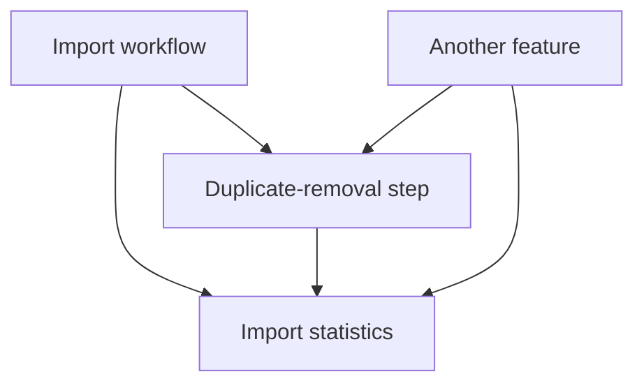
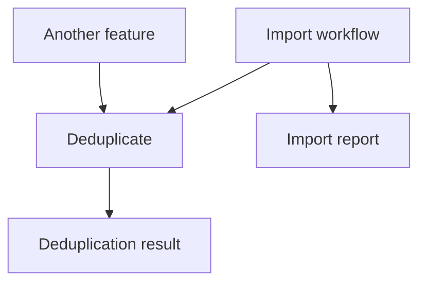

# Deciding what code should know

Software design · C#

<!--
Basic C# is assumed. Read the concept, then use the examples to explain it. Sections spanning several slides share their original teaching-time allocation.
-->

---

# Add reporting to a working import

```csharp
var names = ReadNames(source);
var unique = RemoveDuplicates(names);
WriteNames(destination, unique);
```

For `["Ann", "Bob", "Ann"]`, we write `["Ann", "Bob"]`.

New requirement:

```text
Read: 3
Removed as duplicates: 1
Written: 2
```

Where should the workflow get these numbers?

<!--
Teaching notes · 2 minutes

Recap the input/output contract from lesson 1. This is one small program; no project structure or pipeline framework is required.

Assume eager collections and a writer whose successful return means all supplied names were written. If partial writes must be reported, that requires a richer writer contract. Do not drag that scenario into this example.
-->

---

# A direct implementation makes the step know the import report

**Coupling:** dependencies and assumptions connecting different parts of a program.

<div class="grid grid-cols-2 gap-6">

<div>

```csharp
IReadOnlyList<string> RemoveDuplicatesForReport(
    IReadOnlyList<string> names,
    ImportStatistics outStatistics)
{
    var unique = RemoveDuplicates(names);
    outStatistics.AddRemoved(
        names.Count - unique.Count);
    return unique;
}
```

</div>

<div>

The reporting type supports the whole workflow:

```csharp
sealed class ImportStatistics
{
    // Workflow writers add counts;
    // only the orchestrator should reset.
    public void AddRead(int count)
    { /* accumulate */ }
    public void AddRemoved(int count)
    { /* accumulate */ }
    public void AddWritten(int count)
    { /* accumulate */ }
    public void Reset() { /* clear for another run */ }
}
```

</div>

</div>

The step is given more knowledge and access than duplicate removal needs.

<!--
Teaching notes · 3 minutes

Method bodies are abbreviated API sketches; the actual accumulator implementation is in the reference code. Counts are private and additions reject negative values. No public setter is offered.

The outStatistics name and AddRemoved operation make mutation explicit. Do not present mutation itself as the problem. The concern is that a step intended for independent use accepts the whole ImportStatistics type.

The comment communicates the reset restriction but does not enforce it. We will later compare this with a narrower interface rather than silently pretending the comment prevents misuse.
-->

---

# Show what the extra dependency permits

<div class="grid grid-cols-2 gap-6">

<div>

A second feature only wants unique names:

```csharp
var unusedImportReport = new ImportStatistics();
var unique = RemoveDuplicatesForReport(
    names, unusedImportReport);
```

</div>

<div>

An accidental change inside the reporting step:

```csharp
// Compiles, but erases earlier workflow counts:
outStatistics.Reset();
outStatistics.AddRemoved(removedCount);
```

</div>

</div>

The first caller must invent an irrelevant import report. The second fragment violates the report's accumulation rule.

<!--
Teaching notes · 2 minutes

Distinguish the two consequences. Reuse requiring an irrelevant object is architectural friction, not a compiler error. Resetting inside the step is a concrete behavioral error under the stated workflow convention.

Not every dependency causes either problem. Name the actual dependency and its consequence instead of saying that coupling is bad in the abstract.
-->

---

# Return information about the operation itself

```csharp
record DeduplicationResult(IReadOnlyList<string> Names, int RemovedCount);

DeduplicationResult Deduplicate(IReadOnlyList<string> names)
{
    var unique = RemoveDuplicates(names);
    var result = new DeduplicationResult(
        unique, names.Count - unique.Count);
    return result;
}
```

```csharp
var result = Deduplicate(new[] { "Ann", "Bob", "Ann" });
// result.Names: ["Ann", "Bob"]
// result.RemovedCount: 1
```

The result describes duplicate removal. It has no import-specific fields.

<!--
Teaching notes · 3 minutes

Keep the returned-result approach as the main positive example. RemoveDuplicates is the complete implementation already shown in lesson 1; Deduplicate adds the required information to the result.

A tuple could work too. A named result keeps the explanation readable. IReadOnlyList limits what result consumers can do through that view; it is not a deep immutability guarantee.

For this eager collection, the caller could calculate the count from lengths. That simpler alternative is valid. A result becomes more valuable when it contains information callers cannot reconstruct, such as distinct rejection reasons. Do not require a wrapper result without such a need.
-->

---

# The workflow builds its own report

```csharp
record ImportReport(string Source, int Read, int Removed, int Written);
```

<div class="grid grid-cols-2 gap-6">

<div>

```csharp
var names = ReadNames(source);
var result = Deduplicate(names);
WriteNames(destination, result.Names);

var report = new ImportReport(
    Source: source,
    Read: names.Count,
    Removed: result.RemovedCount,
    Written: result.Names.Count);
ShowReport(report);
```

</div>

<div>

A different caller can use the same operation:

```csharp
var result = Deduplicate(selectedNames);
ShowNames(result.Names);
```

</div>

</div>

<!--
Teaching notes · 3 minutes

Read both caller examples. The import assembles a report because it knows the source, the write operation, and the meaning of the report fields. The other caller does not create an import report at all.

Name orchestration as arranging calls and combining their results. No extra orchestrator class is required. The workflow legitimately depends on the operations it uses.
-->

---

# Architecture includes deciding who knows about whom

<div class="grid grid-cols-2 gap-6">

<div>

An unwanted relationship:

```csharp
RemoveDuplicatesForReport(names, importStatistics);
```



</div>

<div>

The independent result:

```csharp
// No import report required:
var result = Deduplicate(names);
```



</div>

</div>

Arrows show selected code dependencies, not execution order.

<!--
Teaching notes · 2 minutes

The second diagram omits the callers' dependencies on the result type for readability; explain that both callers also use its contract. It is not a claim that results are dependency-free.

Architecture is the significant arrangement of responsibilities and dependencies. These decisions exist even in one file. A folder move alone does not remove the ImportStatistics parameter. Assemblies can enforce boundaries later; they are not needed to understand the difference.

Refer to the previous slide's executable use patterns and the reset error on slide 3. The diagram should summarize concrete code the students have already seen.
-->

---

# Call order can be another dependency

Suppose a parser defaults to comma-separated input.

<div class="grid grid-cols-2 gap-6">

<div>

Correct setup order:

```csharp
var parser = new TextParser();
parser.Separator = ';';
var values = parser.Parse("a;b"); // ["a", "b"]
```

</div>

<div>

The setup comes too late:

```csharp
var parser = new TextParser();
var values = parser.Parse("a;b"); // ["a;b"]
parser.Separator = ';';
```

</div>

</div>

No setup sequence to remember:

```csharp
var values = Parse("a;b", separator: ';'); // ["a", "b"]
```

<!--
Teaching notes · 3 minutes

The simple parser just uses text.Split(Separator). This is not a full CSV parser. The replacement Parse helper is text.Split(separator); both implementations appear in the reference code.

A configured parser object can also be appropriate: new TextParser(';') can establish the setting before the instance is usable. Prefer that when the object owns useful configuration across many calls. The point is to expose required information or enforce setup, rather than demand one universal syntax.

This demonstrates a dependency on call order even when method signatures do not mention it. Memory ownership is not needed to explain this example.
-->

---

# An increment-only view can make mutation more precise

```csharp
interface IRemovalCounter
{
    void AddRemoved(int count);
}
```

```csharp
IReadOnlyList<string> DeduplicateAndCount(
    IReadOnlyList<string> names, IRemovalCounter outStatistics)
{
    var result = Deduplicate(names);
    outStatistics.AddRemoved(result.RemovedCount);
    // outStatistics.Reset(); // Does not compile through this interface.
    return result.Names;
}
```

The contract allows adding non-negative counts. It does not offer resetting them.

<!--
Teaching notes · 3 minutes

This is a valid alternative when reporting during an operation is actually useful. The implementation of AddRemoved must reject negative values if increment-only behavior is promised. A method name alone does not establish that restriction.

The orchestrator can hold an ImportStatistics instance that implements IRemovalCounter and exposes Reset to the orchestrator. The step is passed only the narrow view. Deliberate downcasts can bypass an interface restriction; this is an API design technique, not a security boundary.

Compare cost explicitly: a comment is less code but relies on callers respecting it; a narrow interface better describes permitted operations but adds another type. The returned result remains the simplest main path here.
-->

---

# Generic reporting can let the outside interpret an event

The operation reports a fact:

```csharp
record ItemsRemoved(int Count);

// Inside the operation:
context.Report(new ItemsRemoved(removedCount));
```

The workflow chooses what that fact means for its report:

```csharp
var context = new ReportingContext();
context.On<ItemsRemoved>(e => importStatistics.AddRemoved(e.Count));
var unique = DeduplicateWithReporting(names, context);
```

Another caller can label it differently:

```csharp
context.On<ItemsRemoved>(e => Console.WriteLine($"Selection shortened by {e.Count}"));
```

<!--
Teaching notes · 2 minutes

ReportingContext is an illustrative small event-dispatch API, not a built-in .NET type. It is intentionally not implemented as a framework exercise in this lesson. For the alternative caller, use a separate context; the fragments show different caller choices, not necessarily simultaneous subscriptions.

The step knows ItemsRemoved, a fact about its own operation. It does not know the import report or its fields. This is a legitimate use of the generic context, not a deliberately broken example dressed up as one.

Callbacks and event dispatch add behavior to understand: when reporting happens and how failures are handled. For the current one-result operation, returning a result is simpler. The alternative is useful to recognize, not a new required pattern to memorize.
-->

---

# Cohesion asks what belongs together

**Cohesion:** how well the things inside a function, class, or module belong together.

These values have a shared rule:

```csharp
if (min > max)
    throw new ArgumentException("Bounds are reversed.");
```

So we give them a meaningful home:

```csharp
var interval = Interval.Create(10, 20,
    Boundary.Inclusive, Boundary.Exclusive);
bool allowed = interval.Contains(15);
```

The bounds, their endpoint kinds, and their interpretation belong together because they define one interval.

<!--
Teaching notes · 3 minutes

This begins five consecutive cohesion slides. Avoid explaining the word through another equally abstract definition. Start with the interval students already know.

Related things are related for a reason. Two values can belong together because a rule connects them. A method can belong with them because it needs that rule and representation.

Cohesion does not mean every class has one field or every function has one instruction.
-->

---

# Two operations may share one rule

Names in this index are ASCII identifiers and should match without case differences.

```csharp
index.Add("ann".ToLowerInvariant(), 7);
index.TryGetValue("ann", out var id); // true, id is 7
```

Now a different caller uses uppercase:

```csharp
index.TryGetValue("ANN", out var id); // false: caller forgot normalization
```

Correcting this caller alone leaves the same trap for the next one:

```csharp
index.TryGetValue(name.ToLowerInvariant(), out var id);
```

Insertion and lookup must agree about name comparison.

<!--
Teaching notes · 3 minutes

Assume index is an ordinary case-sensitive Dictionary<string,int>. Start with the successful lowercase lookup, then show the failed uppercase lookup. The requirement is already established, so false is a behavior defect rather than merely another reasonable convention.

Do not turn this into a lesson about international names. ASCII identifiers keep the example's comparison behavior focused.

Ask which rule is duplicated across callers. Moving only the lowercasing expression into a helper would still require callers to remember to use it at every relevant point.
-->

---

# One abstraction can own both sides of that rule

```csharp
sealed class NameIndex
{
    private readonly Dictionary<string, int> _ids =
        new(StringComparer.OrdinalIgnoreCase);

    public void Add(string name, int id) => _ids.Add(name, id);
    public bool TryFind(string name, out int id)
        => _ids.TryGetValue(name, out id);
}
```

```csharp
var index = new NameIndex();
index.Add("Ann", 7);
index.TryFind("ANN", out var id); // true, id is 7
```

Both operations use the same comparison rule. Callers no longer prepare keys themselves.

<!--
Teaching notes · 3 minutes

Name the contract: equivalent keys compare without case differences, duplicate Add calls are rejected, and TryFind reports whether a matching key exists.

The wrapper is useful when it establishes a boundary used by several consumers. A correctly configured dictionary inside one local function may already suffice. The improvement is not “every dictionary needs a wrapper.”

This is cohesion between operations, not only between fields. Encapsulation prevents ordinary clients from bypassing the chosen comparison by manipulating the private dictionary directly.
-->

---

# Separate helpers can still leave the shared rule with every caller

```csharp
string NormalizeKey(string name) => name.ToLowerInvariant();
void Store(Dictionary<string, int> data, string key, int id)
    => data.Add(key, id);
bool Find(Dictionary<string, int> data, string key, out int id)
    => data.TryGetValue(key, out id);
```

<div class="grid grid-cols-2 gap-6">

<div>

A caller must assemble them correctly:

```csharp
Store(data, NormalizeKey(name), id);
Find(data, name, out id); // Again forgets NormalizeKey.
```

</div>

<div>

With the shared rule owned by the index:

```csharp
index.Add(name, id);
index.TryFind(name, out id);
```

</div>

</div>

More functions did not by themselves establish a better boundary.

<!--
Teaching notes · 3 minutes

The general Store and Find helpers could be useful elsewhere. They do not solve the case-insensitive index requirement on their own. Their caller still owns the obligation to normalize correctly.

Do not claim all separation is harmful. Show the specific knowledge that remains scattered after this particular extraction. The NameIndex version owns the relationship that these call sites repeatedly have to reconstruct.
-->

---

# Using the same data does not make responsibilities belong together

A broad helper:

```csharp
void AddName(NameIndex index, string name, int id, string reportPath)
{
    index.Add(name, id);
    File.AppendAllText(reportPath, $"Added {name}\n");
}
```

Now every insertion needs a file-report destination.

<div class="grid grid-cols-2 gap-6">

<div>

An independently useful index plus a caller-specific action:

```csharp
index.Add(name, id);
File.AppendAllText(reportPath, $"Added {name}\n");
```

</div>

<div>

Another caller can simply write:

```csharp
index.Add(name, id);
```

</div>

</div>

Cohesion asks what belongs together. Coupling asks what each part depends on.

<!--
Teaching notes · 3 minutes

Insertion and name comparison belong together because of the shared index rule. Insertion and file reporting merely happen together in this workflow. Another caller demonstrates why the distinction matters.

The two-line workflow can itself deserve a named function if that compound action is a meaningful operation. Give it a name such as RegisterNameAndWriteAudit and an appropriate contract. Do not pretend it is the general-purpose index insertion operation.

End the cohesion section by having students state the shared rule or purpose in their own words. “Both use strings” and “they are in the same file” do not justify grouping.
-->

---

# A concrete change shows whether the boundary helps

New requirement: include the destination in the import report.

```diff
 record ImportReport(
-    string Source, int Read, int Removed, int Written);
+    string Source, string Destination, int Read, int Removed, int Written);
```

<div class="grid grid-cols-2 gap-6">

<div>

The workflow adds it:

```csharp
var report = new ImportReport(source, destination,
    names.Count, result.RemovedCount,
    result.Names.Count);
```

</div>

<div>

Duplicate removal still has the same interface:

```csharp
DeduplicationResult Deduplicate(
    IReadOnlyList<string> names);
```

</div>

</div>

The report changes where it is assembled.

<!--
Teaching notes · 2 minutes

Maintainability concerns understanding, correcting, and changing a program while preserving the behavior that should remain. Ask what must be read, edited, and checked for this concrete change.

Do not promise that all changes affect one place. An intended contract change can appropriately affect many callers. This example isolates a report-only change that should not change duplicate removal's job.
-->

---

# Technical debt has a continuing cost you can point to

**Technical debt:** an existing condition that imposes extra future work or risk.

<div class="grid grid-cols-2 gap-6">

<div>

Repeated convention:

```csharp
Store(data, NormalizeKey(name), id);
Find(data, NormalizeKey(name), out id);
// Every new caller must remember the same preparation.
```

</div>

<div>

A rule owned in one place:

```csharp
index.Add(name, id);
index.TryFind(name, out id);
```

</div>

</div>

Interest is the repeated work around it. Repayment is work to reduce that condition.

<!--
Teaching notes · 2 minutes

Use the metaphor to discuss this particular cost, not to classify every imperfect design. A new caller forgetting normalization, repeated fixes, or repeated coordinated edits are concrete evidence.

Debt can be deliberate, accidental, or discovered after learning more. A simple design that later needs a new feature is not automatically a mistake. Whether to change it depends on the cost of leaving it and the cost of changing it.

[Sources]
- https://martinfowler.com/bliki/TechnicalDebtQuadrant.html
-->

---

# Refactoring changes structure while keeping the promised behavior

**Refactoring:** change internal structure while preserving observable behavior.

<div class="grid grid-cols-2 gap-6">

<div>

Before, repeated in the screen and alarm:

```csharp
bool allowed = interval.Contains(readings.Left)
    && interval.Contains(readings.Center)
    && interval.Contains(readings.Right);
```

</div>

<div>

After:

```csharp
bool allowed = AllWithin(readings, interval);
```

</div>

</div>

Check the same cases before and after:

```csharp
AllWithin(new Readings(12, 15, 18), interval); // true for [10,20)
AllWithin(new Readings(12, 25, 18), interval); // false
AllWithin(new Readings(10, 15, 20), interval); // false
```

<!--
Teaching notes · 2 minutes

The full AllWithin body is in lesson 1. These are example behavior checks; a test would assert the expected results. Preserve relevant failures and effects too, not just the most common return value.

Repairing the broken uppercase lookup changes behavior and is a bug fix. Subsequent restructuring that preserves the corrected behavior is refactoring. Do not silently combine the two and call all of it refactoring.

[Sources]
- https://martinfowler.com/refactoring/
-->

---

# Over-engineering adds complexity that the problem does not justify

Current requirement: write one plain-text report to a file.

<div class="grid grid-cols-2 gap-6">

<div>

```csharp
var text = FormatReport(report);
File.WriteAllText(path, text);
```

</div>

<div>

An elaborate alternative:

```csharp
var destination = destinationFactory
    .Create(settings.DestinationKind);
var formatter = formatterRegistry
    .Resolve(settings.FormatKind);
var writer = writerFactory
    .Create(destination, formatter);
writer.Write(report);
```

</div>

</div>

The second version needs factories, configuration, and registrations even though only one format and destination are required.

What useful requirement pays for that complexity today?

<!--
Teaching notes · 3 minutes

The factories are hypothetical application APIs, not a framework to implement. The displayed code reveals the extra decisions and dependencies. Code bodies would add still more maintenance work.

This design could be appropriate if several formats and destinations are actual requirements, or a present testing/deployment constraint calls for a boundary. Do not portray factories as inherently bad.

Define over-engineering as complexity disproportionate to the problem and justified needs. It includes excessive indirection, speculative configuration, and unnecessary extensibility, not only excessive numbers of classes.
-->

---

# Do not build an abstraction around an imagined future

Only a file destination is required today:

```csharp
File.WriteAllText(path, FormatReport(report));
```

<div class="grid grid-cols-2 gap-6">

<div>

A hypothetical future leads to:

```csharp
writer.Write(report, destinationKind, formatKind,
    retryMode, compressionMode, remoteCredentials);
```

</div>

<div>

But a later browser preview might need:

```csharp
string text = FormatReport(report);
ShowPreview(text);
```

</div>

</div>

The imagined destination framework may not help with the actual request.

<!--
Teaching notes · 2 minutes

State the rule explicitly: do not introduce an abstraction solely because a speculative future use might need it. You may not know the future requirements well enough to choose the right boundary or contract.

Formatting separate from writing can already help explain and test the current behavior. Its justification is present. A generalized remote-delivery framework is a different investment.

This does not mean intentionally tangling current responsibilities until there are two callers. Meaningful names, isolated representation-dependent operations, and clear contracts can earn their place today.
-->

---

# A workflow-specific wrapper can be an intentional choice

```csharp
private static IReadOnlyList<string> DeduplicateForImport(
    IReadOnlyList<string> names, ImportStatistics outStatistics)
{
    var result = Deduplicate(names);
    outStatistics.AddRemoved(result.RemovedCount);
    return result.Names;
}
```

<div class="grid grid-cols-2 gap-6">

<div>

Used inside that import:

```csharp
var unique = DeduplicateForImport(
    names, importStatistics);
```

</div>

<div>

Another feature uses the independent operation:

```csharp
var result = Deduplicate(names);
```

</div>

</div>

The wrapper intentionally knows the import. Its name and scope make that choice visible.

<!--
Teaching notes · 2 minutes

A short operation deliberately confined to one workflow may reasonably use that workflow's context. Here we preserve the independent operation and make the adaptation explicit. We do not need a generic event bus to adapt one call.

Even without a separate independent operation yet, a one-off workflow function can be a reasonable simple design. If independent use becomes a requirement, reconsider its boundary. Do not promise that a comment or private modifier removes the dependency; they communicate the intended scope.

The AddRemoved-only convention still applies to this wrapper. A narrower view can enforce the offered operations if the added type is worth it.
-->

---

# Compare what each abstraction buys and costs

<div class="grid grid-cols-2 gap-6">

<div>

A direct readable requirement:

```csharp
if (min > max)
    throw new ArgumentException("Bounds are reversed.");
```

A useful operation hiding repeated field knowledge:

```csharp
bool allowed = AllWithin(readings, interval);
```

</div>

<div>

A restricted writing interface:

```csharp
IReadOnlyList<string> DeduplicateAndCount(
    IReadOnlyList<string> names,
    IRemovalCounter outStatistics)
{
    var result = RemoveDuplicates(names);
    outStatistics.AddRemoved(
        names.Count - result.Count);
    // outStatistics.Reset(); // Not available
    // through this interface.
    return result;
}
```

</div>

</div>

The helper can hide details. The interface can restrict access. Each also adds a name, contract, or type to understand.

<!--
Teaching notes · 2 minutes

This slide repeats the code rather than asking students to remember a reference in the notes. Discuss why AllWithin earned extraction, why the direct guard can remain inline, and why the reporting interface is a trade-off in capability clarity versus additional declarations.

The restricted parameter makes the allowed mutation visible: this operation can add to the removed count, but its declared interface offers no reset. The cost is defining and understanding another interface. For a small, deliberately confined workflow, a documented convention may be sufficient.

There is no universal line count or parameter count that settles these decisions. State the benefit, the cost, and the current need.
-->

---

# Review a function that knows too much

```csharp
IReadOnlyList<string> CleanNames(
    IReadOnlyList<string> names, ImportContext context)
{
    context.Statistics.Reset();
    var result = RemoveEmptyAndDuplicateNames(names);
    context.Statistics.AddRemoved(names.Count - result.Count);
    context.ReportSource = context.SourcePath;
    return result;
}
```

For `["", "Ann", "Ann"]`, the desired accepted names are `["Ann"]`.

The workflow also needs separate empty and duplicate counts, the source filename, and completion time.

Which information should come from the operation? Which belongs to its caller?

<!--
Teaching notes · 2 minutes

ImportContext is an illustrative application type. The shown Reset breaks accumulation if earlier stages have reported counts. The input view is correctly read-only; the issue is the workflow-specific context and reset access.

Students should request separate operation facts because they cannot recover both rejection categories from the final length. The filename and completion clock belong to the workflow. State the classification rule: discard empty strings first; among non-empty strings, retain first occurrences using ordinal comparison.

Next slide supplies concrete implementation code and the following slide shows its caller, so the exercise does not end in an instruction to imagine the missing code.
-->

---

# Return the rejection facts from the operation

```csharp
record CleanResult(IReadOnlyList<string> Names, int Empty, int Duplicates);

static CleanResult CleanNames(IReadOnlyList<string> names)
{
    var seen = new HashSet<string>(StringComparer.Ordinal);
    var accepted = new List<string>();
    int empty = 0, duplicates = 0;
    foreach (var name in names)
    {
        if (name.Length == 0) { empty++; continue; }
        if (!seen.Add(name)) { duplicates++; continue; }
        accepted.Add(name);
    }
    var result = new CleanResult(accepted, empty, duplicates);
    return result;
}
```

`["", "Ann", "Ann"]` produces names `["Ann"]`, empty `1`, duplicates `1`.

<!--
Teaching notes · 3 minutes

Assume non-null strings. Empty means length zero; whitespace-only strings are not silently treated as empty. Show an ordinary already-clean input too: ["Ann", "Bob"] has zero rejection counts.

The result carries information intrinsic to the cleaning operation. No report name, source path, or clock is needed. The loop's branches implement one coherent classification operation, not three unrelated responsibilities.

The compact guards are for fitting this prototype. A presentation renderer may spread the code across reveals; do not shrink text to fit it on a final slide.
-->

---

# The caller adds the workflow information

<div class="grid grid-cols-2 gap-6">

<div>

```csharp
var names = ReadNames(source);
var result = CleanNames(names);
WriteNames(destination, result.Names);

var report = new CleaningReport(
    Source: source,
    Empty: result.Empty,
    Duplicates: result.Duplicates,
    Written: result.Names.Count,
    CompletedAt: clock.UtcNow);
ShowReport(report);
```

</div>

<div>

Another caller:

```csharp
var result = CleanNames(selectedNames);
ShowNames(result.Names);
```

</div>

</div>

The operation owns cleaning. The workflow owns its report and execution context.

<!--
Teaching notes · 2 minutes

CleaningReport is a data record with the displayed named members; clock is an explicitly supplied clock dependency of the workflow. Completion here means successful reading, cleaning, and writing; a failed write does not reach this reporting code.

The operation's contract is usable without knowing either caller. The import legitimately combines facts from its steps with its source and clock. Both caller examples are present on the slide.

Finish by asking for one actual cost: a result type is another contract; counters add work; richer diagnostics may need storage. Those costs are justified by the reporting requirement we started with. A hypothetical reporting framework has not yet earned its place.
-->
