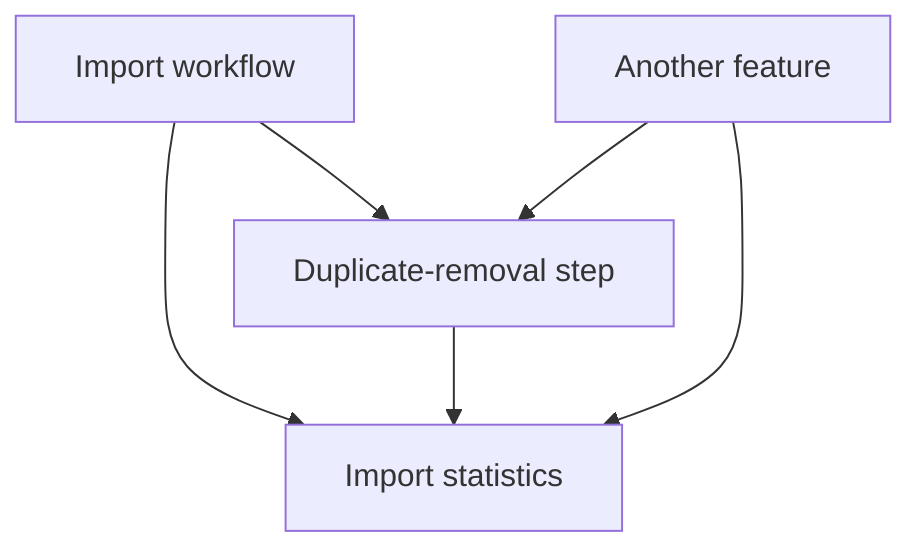
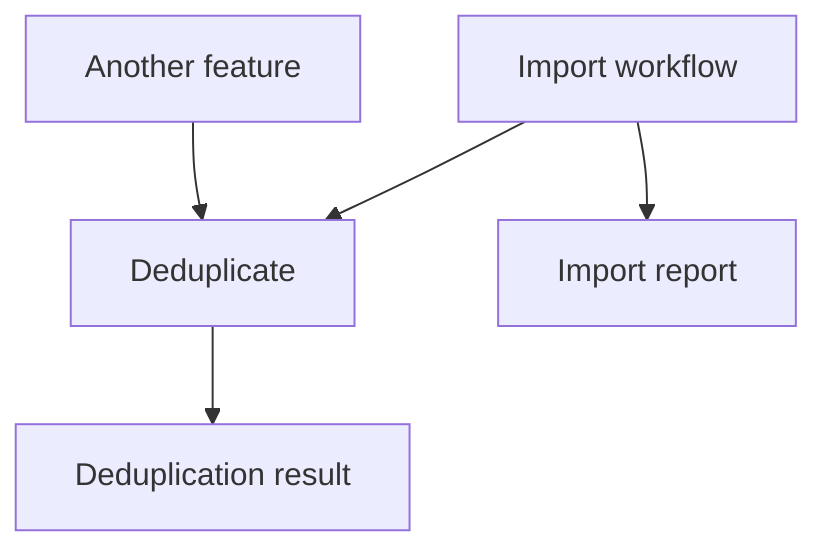

# Software design: presentation prototype

Two approximately one-hour lessons, with code on the slides and expandable teaching notes. Basic C# functions, classes, structs, collections, loops, and interfaces are assumed. All examples are invented. The slides are Markdown source for review, not a configured presentation-engine project.

Each numbered section is a slide. Horizontal rules separate slides. The notes contain explanations, expected answers, and timing; they are not projected slide text. Before/after snippets show alternatives and are not all declarations to paste into one program. Complete supporting implementations for the interval, parser, and statistics examples appear after the lessons.

Lesson 1 establishes contracts, abstraction levels, and local reasoning. Lesson 2 uses those ideas to explain dependencies, cohesion, and the cost of change. A returned result is the main reporting design; narrower writing interfaces and generic reporting are alternatives to compare.

# Lesson 1: understanding code through abstractions

## 1. Start with the ordinary cases

```csharp
Between(15, 10, 20); // true: clearly inside
Between(5, 10, 20);  // false: below the interval
Between(25, 10, 20); // false: above the interval
```

The operation checks whether a value is between two bounds. Here is the implementation used in these examples:

```csharp
static bool Between(int value, int min, int max)
{
    if (min > max)
        throw new ArgumentException("Bounds are reversed.");

    bool result = value >= min && value <= max;
    return result;
}
```

Both endpoints are included. Reversed bounds cause an exception.

<details>
<summary>Teaching notes · 2 minutes</summary>

"Fifteen is inside this interval; five and twenty-five are outside. The implementation checks both bounds and combines the answers. It also rejects reversed bounds. We can now see exactly what this version does.

But someone calling the function may only see its name and arguments. Would that tell them which endpoints are included? Keep that question in mind as we look at the next calls."

</details>

---

## 2. Make argument roles and endpoint behavior clear

**Interface:** how other code interacts with an operation.
**Implementation:** the code that carries it out.

```csharp
Between(10, 10, 20); // Is the lower bound included?
Between(20, 10, 20); // Is the upper bound included?
Between(15, 20, 10); // What about reversed bounds?
```

In `Between(10, 10, 20)`, the repeated numbers do not explain their roles. Named arguments make those roles visible:

```csharp
Between(value: 10, min: 10, max: 20);
```

Named constants can also explain what the bounds mean in the application:

```csharp
const int MinimumAllowedTemperature = 10;
const int MaximumAllowedTemperature = 20;
int measuredTemperature = 10;

bool allowed = Between(
    value: measuredTemperature,
    min: MinimumAllowedTemperature,
    max: MaximumAllowedTemperature);
```

Argument names explain each parameter's role. Constant names explain why these particular values are used. Neither yet says whether the endpoints are included.

The signature tells us how to call it, but not all of its behavior.

<details>
<summary>Teaching notes · 2 minutes</summary>

"The first two tens have different jobs: one is the measurement, and one is the lower bound. Named arguments let us see that without looking up the parameter order. The constants add application meaning: these are the permitted temperatures, not arbitrary numbers.

We saw the implementation, so we know that equality is accepted. But the name Between alone leaves that unclear. The next change will communicate it at the call site too.

An interface is how we interact with something. That includes function names and parameters; it does not only mean a C# interface declaration."

</details>

---

## 3. State the contract, and make the name help

**Contract:** what callers must satisfy and what they may rely on.

```csharp
BetweenInclusive(value: 10, minInclusive: 10, maxInclusive: 20); // true
BetweenInclusive(value: 20, minInclusive: 10, maxInclusive: 20); // true
BetweenInclusive(value: 25, minInclusive: 10, maxInclusive: 20); // false
```

For this function, the contract is:

- The bounds must be ordered: `minInclusive <= maxInclusive`.
- Both endpoints are included.
- The function returns whether the value is inside that interval.
- It changes no external state.

```csharp
bool BetweenInclusive(int value, int minInclusive, int maxInclusive);
```

<details>
<summary>Teaching notes · 3 minutes</summary>

"A contract tells us what we must supply and what we can expect back. Here the argument names identify the value and both inclusive bounds. Ten and twenty are included, while twenty-five is outside. The bounds must be ordered; the next slide explains how a function checks that requirement."

For this tiny operation, the contract is almost the same length as the implementation. That makes the contract easy to inspect; it does not demonstrate a large reduction in complexity. Two inline comparisons can be entirely reasonable.

Other contract dimensions belong with examples that need them. We will demonstrate result order with deduplication and required call order with parser setup. Resource ownership is not needed for this integer example.

</details>

---

## 4. Validate an input or assert an established assumption

A boundary that promises to reject invalid bounds:

```csharp
if (minInclusive > maxInclusive)
    throw new ArgumentException("Bounds are reversed.");
```

A helper whose caller already establishes the condition:

```csharp
Debug.Assert(minInclusive <= maxInclusive);
```

A public entry point often validates. An internal helper can assert an assumption already established by its callers.

`Debug.Assert` checks an assumption while debugging; it does not repair the arguments. In a normal Release build, this check is omitted. If the function promises to reject reversed bounds at runtime, keep the `throw` check.

<details>
<summary>Teaching notes · 3 minutes</summary>

"Suppose min is twenty and max is ten. An assertion can draw our attention to that mistake while debugging. It does not swap the numbers, and in a normal Release build the assertion call is absent.

If our function promises to throw for reversed bounds, we need the explicit validation shown above. If every caller has already established that the bounds are ordered, an internal helper can use an assertion to catch a programming mistake instead of repeating runtime validation.

Being private is not itself a guarantee. We must be able to point to where the arguments were checked or constructed correctly. A short guard can stay right here; extracting it into another function would not necessarily make it clearer."

[Sources]
- https://learn.microsoft.com/en-us/dotnet/api/system.diagnostics.debug.assert

</details>

---

## 5. A useful abstraction can hide a substantial operation

**Abstraction:** a view or interface that exposes selected properties and operations while allowing us to disregard other details.

```csharp
RemoveDuplicates(new[] { "Ann", "Bob", "Ann" });
// ["Ann", "Bob"]

RemoveDuplicates(new[] { "Ann", "Bob" });
// ["Ann", "Bob"]
```

Contract: retain each distinct name once, in first-occurrence order. Compare names ordinally. Leave the input unchanged.

What does the caller no longer have to implement?

<details>
<summary>Teaching notes · 3 minutes</summary>

Assume a non-null input containing non-null strings. Explain ordinal comparison through one additional example: ["Ann", "ann"] retains both.

The caller needs the meaning of duplicate removal, not a choice of data structure or a traversal algorithm. We can now show a function whose contract is substantially simpler than its implementation.

A one-use function can still be worthwhile. Reuse is one benefit of abstraction, not its definition.

</details>

---

## 6. The caller and implementation work at different levels

**Abstraction level:** how much implementation detail a piece of code works with. A higher-level operation lets its caller work without handling its lower-level steps.

The caller:

```csharp
var uniqueNames = RemoveDuplicates(names);
```

One implementation:

```csharp
static IReadOnlyList<string> RemoveDuplicates(IReadOnlyList<string> names)
{
    var seen = new HashSet<string>(StringComparer.Ordinal);
    var unique = new List<string>();
    foreach (var name in names)
    {
        if (seen.Add(name))
            unique.Add(name);
    }
    IReadOnlyList<string> result = unique;
    return result;
}
```

The caller asks for distinct names. The implementation manages a set, traversal, and accumulation.

<details>
<summary>Teaching notes · 4 minutes</summary>

Walk through ["Bob", "Ann", "Bob"]. The result is ["Bob", "Ann"]. Sorting first would violate the stated order guarantee.

Explain only the relevant operation of HashSet.Add: it reports whether this is a new member. The set implementation itself hides further details. Abstraction levels are relative.

The read-only input view expresses that this operation reads the collection. Explain the type as a view supporting reading and counting, without introducing iterator implementation or ownership theory here. A new result list is produced.

The final local variable follows the instructor's debugging convention: the result can be inspected before return. A simple one-line method can remain an expression-bodied method.

</details>

---

## 7. Changing notation is not the same as hiding implementation

Same value, different notation:

```csharp
int a = 255;
int b = 0xFF;
```

A higher-level operation:

```csharp
var unique = RemoveDuplicates(names);
```

A lower-level step inside it:

```csharp
if (seen.Add(name))
    unique.Add(name);
```

A useful level lets the caller disregard details. Another name alone may add very little.

<details>
<summary>Teaching notes · 2 minutes</summary>

There is no universal numbering of abstraction levels. This call is higher-level relative to the set-and-loop implementation. The set is itself an abstraction over storage and lookup mechanisms.

BetweenInclusive may express an intention slightly differently from two comparisons, but its implementation is already simple. Do not force the same magnitude of benefit onto every function.

Compilation is another familiar connection: source-language operations are implemented through lower-level instructions. A translation between representations does not necessarily go up a level.

[Sources]
- https://www.nationalacademies.org/read/11106/chapter/6

</details>

---

## 7a. Names can express meaning in the system

**Semantic meaning** is what a value or operation means in the system: what it represents, measures, or tells us.

```csharp
int right = 18;
bool indicator = true;
```

What does `right` measure? What does the indicator tell us?

```csharp
int rightSensorTemperature = 18;
bool temperatureWithinAllowedInterval = true;
```

`Right` can be a meaningful physical position in a collection of sensor readings. In another context, it could just be a vague label. `TemperatureWithinAllowedInterval` states an application fact. Both are stored using ordinary C# types, but their names communicate different knowledge.

A name communicates intent; it does not enforce that intent. A field named `temperatureWithinAllowedInterval` must still be computed correctly.

<details>
<summary>Teaching notes · 2 minutes</summary>

"An int tells us what kind of value we can store. It does not tell us whether eighteen is a temperature, a count, or a position. The name supplies some of that meaning.

Right is not automatically a bad name. In a Readings object with Left, Center, and Right sensors, the physical positions may be perfectly clear. Outside that context, rightSensorTemperature tells us more.

The boolean names make a different distinction. Indicator tells us very little about what true means. TemperatureWithinAllowedInterval states the fact being reported. That name knows about our application's temperature rule. We should put the code that establishes that fact where that rule belongs.

Giving something a more descriptive name does not by itself create a higher abstraction level. It helps us understand what the existing value means."

</details>

---

## 8. Normalize the interval's representation

**Normalization:** convert equivalent inputs to one consistent representation.

For integer intervals, store an inclusive start and an exclusive end. Boundary choices affect construction only.

```csharp
var interval = Interval.Create(
    min: 10, max: 20,
    minBoundary: Boundary.Inclusive,
    maxBoundary: Boundary.Exclusive);
// Stored as [10, 20).

interval.Contains(15); // true
interval.Contains(25); // false
interval.Contains(10); // true
interval.Contains(20); // false
```

These inputs all represent the same integers and store the same bounds:

| Input interval | Normalized storage |
| --- | --- |
| [10, 20) | [10, 20) |
| [10, 19] | [10, 20) |
| (9, 20) | [10, 20) |
| (9, 19] | [10, 20) |

<details>
<summary>Teaching notes · 4 minutes</summary>

"Inclusive means the endpoint is allowed. Exclusive means it is not. Each row here contains the integers ten through nineteen.

For an excluded start, we move forward to the next integer. For an included end, we move forward to the first integer outside the interval. Once we do that, the object no longer needs to remember the boundary flags.

This works because we are dealing with integers. Adding one would not preserve the meaning of a floating-point interval."

</details>

---

## 9. An invariant keeps the normalized bounds valid

**Invariant:** a condition the type establishes when constructed and preserves through its operations.

Here, `StartInclusive <= EndExclusive`. Equal bounds represent an empty interval.

```csharp
public readonly struct Interval
{
    public long StartInclusive { get; }
    public long EndExclusive { get; }

    private Interval(long startInclusive, long endExclusive)
    {
        StartInclusive = startInclusive;
        EndExclusive = endExclusive;
    }
    // Factory and Contains follow.
}
```

After rejecting reversed input bounds and invalid enum values, the factory normalizes them:

```csharp
long startInclusive = (long)min
    + (minBoundary == Boundary.Exclusive ? 1 : 0);
long endExclusive = (long)max
    + (maxBoundary == Boundary.Inclusive ? 1 : 0);

// Store all empty intervals as [0, 0).
if (startInclusive >= endExclusive)
    return default;

var result = new Interval(startInclusive, endExclusive);
return result;
```

<details>
<summary>Teaching notes · 4 minutes</summary>

"The factory checks the input and converts it once. Every later operation can rely on ordered, normalized bounds. Invalid construction fails here, close to the cause, instead of allowing a bad value to travel through the program.

The public input is int. Internally we use long so an inclusive int.MaxValue can become an exclusive endpoint one greater without overflowing. The cast happens before addition.

An interval with no integers in it becomes the empty interval [0,0). That also makes default construction a valid empty interval. The complete factory, including validation, is in the reference implementation.

The readonly struct keeps these values together without requiring a separate heap object for each interval. Its get-only properties prevent callers from changing one bound independently."

</details>

---

## 10. Encapsulation keeps bound interpretation inside the interval

**Encapsulation:** a type keeps its representation private and exposes the operations callers are allowed to use.

Add this method inside `Interval`:

```diff
+ public bool Contains(int value)
+ {
+     bool result = value >= StartInclusive && value < EndExclusive;
+     return result;
+ }
```

Callers use the operation:

```csharp
bool allowed = interval.Contains(reading);
```

`Contains` uses the same two comparisons for every interval. It never checks the original boundary choices.

<details>
<summary>Teaching notes · 4 minutes</summary>

"For [10,20), fifteen passes both comparisons. Twenty fails the second. We use the same method even if the caller originally supplied (9,19]. Construction has already converted that input.

Any function receiving an Interval can rely on its bounds being valid. It does not repeat their validation or reinterpret boundary flags. That knowledge belongs in Interval.

The plus signs mark the added code. The temporary result lets us inspect the answer at a breakpoint before returning."

</details>

---

## 11. Local reasoning means using the contracts of your dependencies

**Local reasoning:** understand a piece of code using its own logic and the contracts of what it uses.

```csharp
var unique = RemoveDuplicates(names);
ShowNames(unique);
```

For input `["Bob", "Ann", "Bob"]`, the display receives `["Bob", "Ann"]`.

To understand this code, we need to know:

- What `RemoveDuplicates` returns and whether it changes its input.
- What `ShowNames` does with the result.

We do not need the duplicate-removal algorithm or the display implementation.

<details>
<summary>Teaching notes · 3 minutes</summary>

Keep this explanation focused. Do not undermine it with a separate debate about whether a trivial wrapper should exist. We already have an operation whose contract hides substantial implementation.

Dependencies still exist. The goal is bounded knowledge, not never opening another file. If ShowNames sorts its input in place without saying so, callers cannot reason from the stated contract. That would be a contract problem to repair.

</details>

---

## 12. A caller should not have to list all the fields

```csharp
record struct Readings(int Left, int Center, int Right);
```

Inside the screen update:

```csharp
bool allowed = interval.Contains(readings.Left)
    && interval.Contains(readings.Center)
    && interval.Contains(readings.Right);
SetIndicator(allowed);
```

Inside alarm handling:

```csharp
bool allowed = interval.Contains(readings.Left)
    && interval.Contains(readings.Center)
    && interval.Contains(readings.Right);
if (!allowed)
    SoundAlarm();
```

Adding a sensor means remembering every list of fields.

<details>
<summary>Teaching notes · 3 minutes</summary>

These three values have distinct physical positions, but this operation applies identically to all three. The screen and alarm should not each enumerate the representation.

A new field can leave both fragments compiling while neither checks it. Ask students to identify the duplicated knowledge rather than simply count repeated lines.

Do not introduce arrays, indexing, LINQ, or iterator abstractions to solve this particular problem. A named operation is enough for the first lesson.

</details>

---

## 13. Put the field-by-field operation in one place

```csharp
static bool AllWithin(Readings readings, Interval interval)
{
    bool result = interval.Contains(readings.Left)
        && interval.Contains(readings.Center)
        && interval.Contains(readings.Right);
    return result;
}
```

The screen:

```csharp
bool allowed = AllWithin(readings, interval);
SetIndicator(allowed);
```

The alarm:

```csharp
if (!AllWithin(readings, interval))
    SoundAlarm();
```

The helper owns the enumeration of fields. Both callers express the operation.

<details>
<summary>Teaching notes · 3 minutes</summary>

Keep the fixed struct. We did not need a new container or an iterator to demonstrate the improvement. The helper could live with the Readings type or a closely related operations module; its physical location is less important than owning this representation-dependent operation.

Adding a sensor still requires updating AllWithin. That responsibility is centralized, not magically eliminated. For an existing collection of equivalent readings, an ordinary loop could implement the same operation. The collection representation is a separate decision.

Same field type alone is not a justification: CustomerId, Age, and RetryCount are all integers but do not form one meaningful set of measurements.

</details>

---

## 14. Another call can help, or just make you look elsewhere

Already understandable:

```csharp
if (min > max)
    throw new ArgumentException("Bounds are reversed.");
```

An additional call:

```csharp
CheckArguments(value, min, max);
```

Its implementation:

```csharp
static void CheckArguments(int value, int min, int max)
{
    if (min > max)
        throw new ArgumentException("Bounds are reversed.");
}
```

The helper hides a clear check and even receives an unused parameter.

<details>
<summary>Teaching notes · 3 minutes</summary>

Define indirection as reaching an operation through another name or call. It can hide complexity and centralize knowledge, but it can also add navigation and a new contract without a useful gain.

Contrast with AllWithin from the previous slide: that function removed field-layout knowledge from multiple callers. Here the abstraction has not earned its cost. A focused, named bounds-validation method could be justified if several operations share a substantial rule. Neither number of parameters nor number of lines decides by itself.

</details>

---

## 15. Show the workflow without its subordinate algorithm

Before:

```csharp
var names = ReadNames(source);
var seen = new HashSet<string>(StringComparer.Ordinal);
var unique = new List<string>();
foreach (var name in names)
{
    if (seen.Add(name))
        unique.Add(name);
}
WriteNames(destination, unique);
```

After extracting the implementation shown earlier:

```csharp
var names = ReadNames(source);
var unique = RemoveDuplicates(names);
WriteNames(destination, unique);
```

The workflow expresses reading, duplicate removal, and writing.

<details>
<summary>Teaching notes · 4 minutes</summary>

Keep both versions visible during discussion. The requirement and the algorithm have not changed. The knowledge needed to read the workflow has changed.

A workflow-level guard can stay direct: if names.Count == 0, return. That decision can belong to the workflow. Extracting EmptyInputCheck merely so every line is a function call would miss the point.

The criterion is a consistent level in the main story, not a syntactic ban on conditions. Normalization code such as Trim and ToLowerInvariant can similarly be appropriate inside NormalizeName but distracting if pasted into otherwise high-level import orchestration.

</details>

---

## 16. Make the necessary input visible

Hidden input:

```csharp
bool IsAllowed(int reading)
    => reading <= Settings.MaximumTemperature;
```

Explicit input:

```csharp
bool IsAllowed(int reading, int maximumTemperature)
    => reading <= maximumTemperature;
```

```csharp
IsAllowed(25, maximumTemperature: 20); // false
IsAllowed(25, maximumTemperature: 30); // true
```

The second signature tells the caller which setting controls this result.

<details>
<summary>Teaching notes · 3 minutes</summary>

The hidden version does not mutate anything here. A hidden dependency and a side effect are different concepts.

A meaningful Interval can replace separate settings when we need an interval's semantics. Do not introduce one for an operation that only needs a maximum. Pass the information the operation needs.

Making a dependency explicit does not make it appropriate. The second lesson will examine a workflow-specific statistics parameter that is explicit but misplaced.

</details>

---

## 17. Use a parameter view that matches the intended access

Reading a collection:

```csharp
IReadOnlyList<string> RemoveDuplicates(IReadOnlyList<string> names);
```

Intentionally changing a collection:

```csharp
void SortInPlace(List<string> outNames)
    => outNames.Sort(StringComparer.Ordinal);
```

```csharp
IReadOnlyList<string> names = new List<string> { "Bob", "Ann" };
// names.Add("Eve"); // Does not compile: this view exposes no Add.
```

The signature should make the permitted access clear.

<details>
<summary>Teaching notes · 3 minutes</summary>

Mutation is a supported design choice, not automatically a defect. Use an operation name and parameter interface that communicate what can change. The outNames prefix is the instructor's naming convention for intentionally written parameters; it is not C#'s out modifier.

IReadOnlyList restricts collection mutation through this view. It does not promise deep immutability of arbitrary elements, exclusive ownership, or a snapshot that nobody else can change. Here strings avoid a second discussion about mutable elements.

The next slide gives a short concrete example of why the view and the underlying object are distinct. Do not introduce the caveat as unexplained ownership terminology.

</details>

---

## 18. Two references can observe the same change

```csharp
var owner = new List<string> { "Bob", "Ann" };
IReadOnlyList<string> readOnlyView = owner;

SortInPlace(owner);

Console.WriteLine(readOnlyView[0]); // Ann
```

The read-only view cannot sort the list, but it sees the owner's change.

A read-only parameter limits what the receiving code is offered. It does not freeze the shared object.

<details>
<summary>Teaching notes · 3 minutes</summary>

Define alias briefly: another reference to the same object. The behavior here is intentional and unsurprising once the relationship is known.

Do not use this as a warning against mutation in general. It explains the precise guarantee made by a read-only view. If stable independent data is required, the contract and representation must provide it; that is a separate requirement.

Close with the lesson's central question: what is this function allowed to use, what may it change, and which implementation details can its caller ignore?

</details>

---

## 19. Compare the knowledge required by two callers

Caller A:

```csharp
bool allowed = interval.Contains(readings.Left)
    && interval.Contains(readings.Center)
    && interval.Contains(readings.Right);
SetIndicator(allowed);
```

Caller B:

```csharp
bool allowed = AllWithin(readings, interval);
SetIndicator(allowed);
```

Explain:

1. What must A know that B does not?
2. What must the contract of `AllWithin` promise?
3. Where would adding a fourth sensor require an edit?
4. Would a wrapper around `SetIndicator(allowed)` help here?

<details>
<summary>Teaching notes · 4 minutes</summary>

Expected answers: A enumerates every field; B needs the guarantee that every reading is checked. The helper still has to be maintained when the representation grows. An extra generic wrapper around a clear SetIndicator call has no demonstrated benefit.

This exercise reinforces abstraction, contracts, and indirection using the example students just saw. There is no arithmetic trap or new domain rule to distract from the design question.

Next lesson: appropriate dependencies. A helper can hide its internals yet still know too much about a particular caller.

</details>

# Lesson 2: deciding what code should know

## 1. Add reporting to a working import

```csharp
var names = ReadNames(source);
var unique = RemoveDuplicates(names);
WriteNames(destination, unique);
```

For `["Ann", "Bob", "Ann"]`, we write `["Ann", "Bob"]`.

New requirement:

```text
Read: 3
Removed as duplicates: 1
Written: 2
```

Where should the workflow get these numbers?

<details>
<summary>Teaching notes · 2 minutes</summary>

Recap the input/output contract from lesson 1. This is one small program; no project structure or pipeline framework is required.

Assume eager collections and a writer whose successful return means all supplied names were written. If partial writes must be reported, that requires a richer writer contract. Do not drag that scenario into this example.

</details>

---

## 2. A direct implementation makes the step know the import report

**Coupling:** dependencies and assumptions connecting different parts of a program.

```csharp
IReadOnlyList<string> RemoveDuplicatesForReport(
    IReadOnlyList<string> names, ImportStatistics outStatistics)
{
    var unique = RemoveDuplicates(names);
    outStatistics.AddRemoved(names.Count - unique.Count);
    return unique;
}
```

The reporting type supports the whole workflow:

```csharp
sealed class ImportStatistics
{
    // Workflow writers add counts; only the orchestrator should reset.
    public void AddRead(int count) { /* accumulate */ }
    public void AddRemoved(int count) { /* accumulate */ }
    public void AddWritten(int count) { /* accumulate */ }
    public void Reset() { /* clear for another run */ }
}
```

The step is given more knowledge and access than duplicate removal needs.

<details>
<summary>Teaching notes · 3 minutes</summary>

Method bodies are abbreviated API sketches; the actual accumulator implementation is in the reference code. Counts are private and additions reject negative values. No public setter is offered.

The outStatistics name and AddRemoved operation make mutation explicit. Do not present mutation itself as the problem. The concern is that a step intended for independent use accepts the whole ImportStatistics type.

The comment communicates the reset restriction but does not enforce it. We will later compare this with a narrower interface rather than silently pretending the comment prevents misuse.

</details>

---

## 3. Show what the extra dependency permits

A second feature only wants unique names:

```csharp
var unusedImportReport = new ImportStatistics();
var unique = RemoveDuplicatesForReport(names, unusedImportReport);
```

An accidental change inside the reporting step:

```csharp
outStatistics.Reset(); // Compiles, but erases earlier workflow counts.
outStatistics.AddRemoved(removedCount);
```

The first caller must invent an irrelevant import report. The second fragment violates the report's accumulation rule.

<details>
<summary>Teaching notes · 2 minutes</summary>

Distinguish the two consequences. Reuse requiring an irrelevant object is architectural friction, not a compiler error. Resetting inside the step is a concrete behavioral error under the stated workflow convention.

Not every dependency causes either problem. Name the actual dependency and its consequence instead of saying that coupling is bad in the abstract.

</details>

---

## 4. Return information about the operation itself

```csharp
record DeduplicationResult(IReadOnlyList<string> Names, int RemovedCount);

DeduplicationResult Deduplicate(IReadOnlyList<string> names)
{
    var unique = RemoveDuplicates(names);
    var result = new DeduplicationResult(
        unique, names.Count - unique.Count);
    return result;
}
```

```csharp
var result = Deduplicate(new[] { "Ann", "Bob", "Ann" });
// result.Names: ["Ann", "Bob"]
// result.RemovedCount: 1
```

The result describes duplicate removal. It has no import-specific fields.

<details>
<summary>Teaching notes · 3 minutes</summary>

Keep the returned-result approach as the main positive example. RemoveDuplicates is the complete implementation already shown in lesson 1; Deduplicate adds the required information to the result.

A tuple could work too. A named result keeps the explanation readable. IReadOnlyList limits what result consumers can do through that view; it is not a deep immutability guarantee.

For this eager collection, the caller could calculate the count from lengths. That simpler alternative is valid. A result becomes more valuable when it contains information callers cannot reconstruct, such as distinct rejection reasons. Do not require a wrapper result without such a need.

</details>

---

## 5. The workflow builds its own report

```csharp
record ImportReport(string Source, int Read, int Removed, int Written);
```

```csharp
var names = ReadNames(source);
var result = Deduplicate(names);
WriteNames(destination, result.Names);

var report = new ImportReport(
    Source: source,
    Read: names.Count,
    Removed: result.RemovedCount,
    Written: result.Names.Count);
ShowReport(report);
```

A different caller can use the same operation:

```csharp
var result = Deduplicate(selectedNames);
ShowNames(result.Names);
```

<details>
<summary>Teaching notes · 3 minutes</summary>

Read both caller examples. The import assembles a report because it knows the source, the write operation, and the meaning of the report fields. The other caller does not create an import report at all.

Name orchestration as arranging calls and combining their results. No extra orchestrator class is required. The workflow legitimately depends on the operations it uses.

</details>

---

## 6. Architecture includes deciding who knows about whom

An unwanted relationship:

```csharp
RemoveDuplicatesForReport(names, importStatistics);
```



The independent result:

```csharp
var result = Deduplicate(names); // No import report required.
```



Arrows show selected code dependencies, not execution order.

<details>
<summary>Teaching notes · 2 minutes</summary>

The second diagram omits the callers' dependencies on the result type for readability; explain that both callers also use its contract. It is not a claim that results are dependency-free.

Architecture is the significant arrangement of responsibilities and dependencies. These decisions exist even in one file. A folder move alone does not remove the ImportStatistics parameter. Assemblies can enforce boundaries later; they are not needed to understand the difference.

Refer to the previous slide's executable use patterns and the reset error on slide 3. The diagram should summarize concrete code the students have already seen.

</details>

---

## 7. Call order can be another dependency

Suppose a parser defaults to comma-separated input.

Correct setup order:

```csharp
var parser = new TextParser();
parser.Separator = ';';
var values = parser.Parse("a;b"); // ["a", "b"]
```

The setup comes too late:

```csharp
var parser = new TextParser();
var values = parser.Parse("a;b"); // ["a;b"]
parser.Separator = ';';
```

No setup sequence to remember:

```csharp
var values = Parse("a;b", separator: ';'); // ["a", "b"]
```

<details>
<summary>Teaching notes · 3 minutes</summary>

The simple parser just uses text.Split(Separator). This is not a full CSV parser. The replacement Parse helper is text.Split(separator); both implementations appear in the reference code.

A configured parser object can also be appropriate: new TextParser(';') can establish the setting before the instance is usable. Prefer that when the object owns useful configuration across many calls. The point is to expose required information or enforce setup, rather than demand one universal syntax.

This demonstrates a dependency on call order even when method signatures do not mention it. Memory ownership is not needed to explain this example.

</details>

---

## 8. An increment-only view can make mutation more precise

```csharp
interface IRemovalCounter
{
    void AddRemoved(int count);
}
```

```csharp
IReadOnlyList<string> DeduplicateAndCount(
    IReadOnlyList<string> names, IRemovalCounter outStatistics)
{
    var result = Deduplicate(names);
    outStatistics.AddRemoved(result.RemovedCount);
    // outStatistics.Reset(); // Does not compile through this interface.
    return result.Names;
}
```

The contract allows adding non-negative counts. It does not offer resetting them.

<details>
<summary>Teaching notes · 3 minutes</summary>

This is a valid alternative when reporting during an operation is actually useful. The implementation of AddRemoved must reject negative values if increment-only behavior is promised. A method name alone does not establish that restriction.

The orchestrator can hold an ImportStatistics instance that implements IRemovalCounter and exposes Reset to the orchestrator. The step is passed only the narrow view. Deliberate downcasts can bypass an interface restriction; this is an API design technique, not a security boundary.

Compare cost explicitly: a comment is less code but relies on callers respecting it; a narrow interface better describes permitted operations but adds another type. The returned result remains the simplest main path here.

</details>

---

## 9. Generic reporting can let the outside interpret an event

The operation reports a fact:

```csharp
record ItemsRemoved(int Count);

// Inside the operation:
context.Report(new ItemsRemoved(removedCount));
```

The workflow chooses what that fact means for its report:

```csharp
var context = new ReportingContext();
context.On<ItemsRemoved>(e => importStatistics.AddRemoved(e.Count));
var unique = DeduplicateWithReporting(names, context);
```

Another caller can label it differently:

```csharp
context.On<ItemsRemoved>(e => Console.WriteLine($"Selection shortened by {e.Count}"));
```

<details>
<summary>Teaching notes · 2 minutes</summary>

ReportingContext is an illustrative small event-dispatch API, not a built-in .NET type. It is intentionally not implemented as a framework exercise in this lesson. For the alternative caller, use a separate context; the fragments show different caller choices, not necessarily simultaneous subscriptions.

The step knows ItemsRemoved, a fact about its own operation. It does not know the import report or its fields. This is a legitimate use of the generic context, not a deliberately broken example dressed up as one.

Callbacks and event dispatch add behavior to understand: when reporting happens and how failures are handled. For the current one-result operation, returning a result is simpler. The alternative is useful to recognize, not a new required pattern to memorize.

</details>

---

## 10. Cohesion asks what belongs together

**Cohesion:** how well the things inside a function, class, or module belong together.

These values have a shared rule:

```csharp
if (min > max)
    throw new ArgumentException("Bounds are reversed.");
```

So we give them a meaningful home:

```csharp
var interval = Interval.Create(10, 20,
    Boundary.Inclusive, Boundary.Exclusive);
bool allowed = interval.Contains(15);
```

The bounds, their endpoint kinds, and their interpretation belong together because they define one interval.

<details>
<summary>Teaching notes · 3 minutes</summary>

This begins five consecutive cohesion slides. Avoid explaining the word through another equally abstract definition. Start with the interval students already know.

Related things are related for a reason. Two values can belong together because a rule connects them. A method can belong with them because it needs that rule and representation.

Cohesion does not mean every class has one field or every function has one instruction.

</details>

---

## 11. Two operations may share one rule

Names in this index are ASCII identifiers and should match without case differences.

```csharp
index.Add("ann".ToLowerInvariant(), 7);
index.TryGetValue("ann", out var id); // true, id is 7
```

Now a different caller uses uppercase:

```csharp
index.TryGetValue("ANN", out var id); // false: caller forgot normalization
```

Correcting this caller alone leaves the same trap for the next one:

```csharp
index.TryGetValue(name.ToLowerInvariant(), out var id);
```

Insertion and lookup must agree about name comparison.

<details>
<summary>Teaching notes · 3 minutes</summary>

Assume index is an ordinary case-sensitive Dictionary<string,int>. Start with the successful lowercase lookup, then show the failed uppercase lookup. The requirement is already established, so false is a behavior defect rather than merely another reasonable convention.

Do not turn this into a lesson about international names. ASCII identifiers keep the example's comparison behavior focused.

Ask which rule is duplicated across callers. Moving only the lowercasing expression into a helper would still require callers to remember to use it at every relevant point.

</details>

---

## 12. One abstraction can own both sides of that rule

```csharp
sealed class NameIndex
{
    private readonly Dictionary<string, int> _ids =
        new(StringComparer.OrdinalIgnoreCase);

    public void Add(string name, int id) => _ids.Add(name, id);
    public bool TryFind(string name, out int id)
        => _ids.TryGetValue(name, out id);
}
```

```csharp
var index = new NameIndex();
index.Add("Ann", 7);
index.TryFind("ANN", out var id); // true, id is 7
```

Both operations use the same comparison rule. Callers no longer prepare keys themselves.

<details>
<summary>Teaching notes · 3 minutes</summary>

Name the contract: equivalent keys compare without case differences, duplicate Add calls are rejected, and TryFind reports whether a matching key exists.

The wrapper is useful when it establishes a boundary used by several consumers. A correctly configured dictionary inside one local function may already suffice. The improvement is not “every dictionary needs a wrapper.”

This is cohesion between operations, not only between fields. Encapsulation prevents ordinary clients from bypassing the chosen comparison by manipulating the private dictionary directly.

</details>

---

## 13. Separate helpers can still leave the shared rule with every caller

```csharp
string NormalizeKey(string name) => name.ToLowerInvariant();
void Store(Dictionary<string, int> data, string key, int id)
    => data.Add(key, id);
bool Find(Dictionary<string, int> data, string key, out int id)
    => data.TryGetValue(key, out id);
```

A caller must assemble them correctly:

```csharp
Store(data, NormalizeKey(name), id);
Find(data, name, out id); // Again forgets NormalizeKey.
```

With the shared rule owned by the index:

```csharp
index.Add(name, id);
index.TryFind(name, out id);
```

More functions did not by themselves establish a better boundary.

<details>
<summary>Teaching notes · 3 minutes</summary>

The general Store and Find helpers could be useful elsewhere. They do not solve the case-insensitive index requirement on their own. Their caller still owns the obligation to normalize correctly.

Do not claim all separation is harmful. Show the specific knowledge that remains scattered after this particular extraction. The NameIndex version owns the relationship that these call sites repeatedly have to reconstruct.

</details>

---

## 14. Using the same data does not make responsibilities belong together

A broad helper:

```csharp
void AddName(NameIndex index, string name, int id, string reportPath)
{
    index.Add(name, id);
    File.AppendAllText(reportPath, $"Added {name}\n");
}
```

Now every insertion needs a file-report destination.

An independently useful index plus a caller-specific action:

```csharp
index.Add(name, id);
File.AppendAllText(reportPath, $"Added {name}\n");
```

Another caller can simply write:

```csharp
index.Add(name, id);
```

Cohesion asks what belongs together. Coupling asks what each part depends on.

<details>
<summary>Teaching notes · 3 minutes</summary>

Insertion and name comparison belong together because of the shared index rule. Insertion and file reporting merely happen together in this workflow. Another caller demonstrates why the distinction matters.

The two-line workflow can itself deserve a named function if that compound action is a meaningful operation. Give it a name such as RegisterNameAndWriteAudit and an appropriate contract. Do not pretend it is the general-purpose index insertion operation.

End the cohesion section by having students state the shared rule or purpose in their own words. “Both use strings” and “they are in the same file” do not justify grouping.

</details>

---

## 15. A concrete change shows whether the boundary helps

New requirement: include the destination in the import report.

```diff
 record ImportReport(
-    string Source, int Read, int Removed, int Written);
+    string Source, string Destination, int Read, int Removed, int Written);
```

The workflow adds it:

```csharp
var report = new ImportReport(source, destination,
    names.Count, result.RemovedCount, result.Names.Count);
```

Duplicate removal still has the same interface:

```csharp
DeduplicationResult Deduplicate(IReadOnlyList<string> names);
```

The report changes where it is assembled.

<details>
<summary>Teaching notes · 2 minutes</summary>

Maintainability concerns understanding, correcting, and changing a program while preserving the behavior that should remain. Ask what must be read, edited, and checked for this concrete change.

Do not promise that all changes affect one place. An intended contract change can appropriately affect many callers. This example isolates a report-only change that should not change duplicate removal's job.

</details>

---

## 16. Technical debt has a continuing cost you can point to

**Technical debt:** an existing condition that imposes extra future work or risk.

Repeated convention:

```csharp
Store(data, NormalizeKey(name), id);
Find(data, NormalizeKey(name), out id);
// Every new caller must remember the same preparation.
```

A rule owned in one place:

```csharp
index.Add(name, id);
index.TryFind(name, out id);
```

Interest is the repeated work around it. Repayment is work to reduce that condition.

<details>
<summary>Teaching notes · 2 minutes</summary>

Use the metaphor to discuss this particular cost, not to classify every imperfect design. A new caller forgetting normalization, repeated fixes, or repeated coordinated edits are concrete evidence.

Debt can be deliberate, accidental, or discovered after learning more. A simple design that later needs a new feature is not automatically a mistake. Whether to change it depends on the cost of leaving it and the cost of changing it.

[Sources]
- https://martinfowler.com/bliki/TechnicalDebtQuadrant.html

</details>

---

## 17. Refactoring changes structure while keeping the promised behavior

**Refactoring:** change internal structure while preserving observable behavior.

Before, repeated in the screen and alarm:

```csharp
bool allowed = interval.Contains(readings.Left)
    && interval.Contains(readings.Center)
    && interval.Contains(readings.Right);
```

After:

```csharp
bool allowed = AllWithin(readings, interval);
```

Check the same cases before and after:

```csharp
AllWithin(new Readings(12, 15, 18), interval); // true for [10,20)
AllWithin(new Readings(12, 25, 18), interval); // false
AllWithin(new Readings(10, 15, 20), interval); // false
```

<details>
<summary>Teaching notes · 2 minutes</summary>

The full AllWithin body is in lesson 1. These are example behavior checks; a test would assert the expected results. Preserve relevant failures and effects too, not just the most common return value.

Repairing the broken uppercase lookup changes behavior and is a bug fix. Subsequent restructuring that preserves the corrected behavior is refactoring. Do not silently combine the two and call all of it refactoring.

[Sources]
- https://martinfowler.com/refactoring/

</details>

---

## 18. Over-engineering adds complexity that the problem does not justify

Current requirement: write one plain-text report to a file.

```csharp
var text = FormatReport(report);
File.WriteAllText(path, text);
```

An elaborate alternative:

```csharp
var destination = destinationFactory.Create(settings.DestinationKind);
var formatter = formatterRegistry.Resolve(settings.FormatKind);
var writer = writerFactory.Create(destination, formatter);
writer.Write(report);
```

The second version needs factories, configuration, and registrations even though only one format and destination are required.

What useful requirement pays for that complexity today?

<details>
<summary>Teaching notes · 3 minutes</summary>

The factories are hypothetical application APIs, not a framework to implement. The displayed code reveals the extra decisions and dependencies. Code bodies would add still more maintenance work.

This design could be appropriate if several formats and destinations are actual requirements, or a present testing/deployment constraint calls for a boundary. Do not portray factories as inherently bad.

Define over-engineering as complexity disproportionate to the problem and justified needs. It includes excessive indirection, speculative configuration, and unnecessary extensibility, not only excessive numbers of classes.

</details>

---

## 19. Do not build an abstraction around an imagined future

Only a file destination is required today:

```csharp
File.WriteAllText(path, FormatReport(report));
```

A hypothetical future leads to:

```csharp
writer.Write(report, destinationKind, formatKind, retryMode,
    compressionMode, remoteCredentials);
```

But a later browser preview might need:

```csharp
string text = FormatReport(report);
ShowPreview(text);
```

The imagined destination framework may not help with the actual request.

<details>
<summary>Teaching notes · 2 minutes</summary>

State the rule explicitly: do not introduce an abstraction solely because a speculative future use might need it. You may not know the future requirements well enough to choose the right boundary or contract.

Formatting separate from writing can already help explain and test the current behavior. Its justification is present. A generalized remote-delivery framework is a different investment.

This does not mean intentionally tangling current responsibilities until there are two callers. Meaningful names, isolated representation-dependent operations, and clear contracts can earn their place today.

</details>

---

## 20. A workflow-specific wrapper can be an intentional choice

```csharp
private static IReadOnlyList<string> DeduplicateForImport(
    IReadOnlyList<string> names, ImportStatistics outStatistics)
{
    var result = Deduplicate(names);
    outStatistics.AddRemoved(result.RemovedCount);
    return result.Names;
}
```

Used inside that import:

```csharp
var unique = DeduplicateForImport(names, importStatistics);
```

Another feature uses the independent operation:

```csharp
var result = Deduplicate(names);
```

The wrapper intentionally knows the import. Its name and scope make that choice visible.

<details>
<summary>Teaching notes · 2 minutes</summary>

A short operation deliberately confined to one workflow may reasonably use that workflow's context. Here we preserve the independent operation and make the adaptation explicit. We do not need a generic event bus to adapt one call.

Even without a separate independent operation yet, a one-off workflow function can be a reasonable simple design. If independent use becomes a requirement, reconsider its boundary. Do not promise that a comment or private modifier removes the dependency; they communicate the intended scope.

The AddRemoved-only convention still applies to this wrapper. A narrower view can enforce the offered operations if the added type is worth it.

</details>

---

## 21. Compare what each abstraction buys and costs

A direct readable requirement:

```csharp
if (min > max)
    throw new ArgumentException("Bounds are reversed.");
```

A useful operation hiding repeated field knowledge:

```csharp
bool allowed = AllWithin(readings, interval);
```

A restricted writing interface:

```csharp
IReadOnlyList<string> DeduplicateAndCount(
    IReadOnlyList<string> names,
    IRemovalCounter outStatistics)
{
    var result = RemoveDuplicates(names);
    outStatistics.AddRemoved(names.Count - result.Count);
    // outStatistics.Reset(); // Not available through this interface.
    return result;
}
```

The helper can hide details. The interface can restrict access. Each also adds a name, contract, or type to understand.

<details>
<summary>Teaching notes · 2 minutes</summary>

This slide repeats the code rather than asking students to remember a reference in the notes. Discuss why AllWithin earned extraction, why the direct guard can remain inline, and why the reporting interface is a trade-off in capability clarity versus additional declarations.

The restricted parameter makes the allowed mutation visible: this operation can add to the removed count, but its declared interface offers no reset. The cost is defining and understanding another interface. For a small, deliberately confined workflow, a documented convention may be sufficient.

There is no universal line count or parameter count that settles these decisions. State the benefit, the cost, and the current need.

</details>

---

## 22. Review a function that knows too much

```csharp
IReadOnlyList<string> CleanNames(
    IReadOnlyList<string> names, ImportContext context)
{
    context.Statistics.Reset();
    var result = RemoveEmptyAndDuplicateNames(names);
    context.Statistics.AddRemoved(names.Count - result.Count);
    context.ReportSource = context.SourcePath;
    return result;
}
```

For `["", "Ann", "Ann"]`, the desired accepted names are `["Ann"]`.

The workflow also needs separate empty and duplicate counts, the source filename, and completion time.

Which information should come from the operation? Which belongs to its caller?

<details>
<summary>Teaching notes · 2 minutes</summary>

ImportContext is an illustrative application type. The shown Reset breaks accumulation if earlier stages have reported counts. The input view is correctly read-only; the issue is the workflow-specific context and reset access.

Students should request separate operation facts because they cannot recover both rejection categories from the final length. The filename and completion clock belong to the workflow. State the classification rule: discard empty strings first; among non-empty strings, retain first occurrences using ordinal comparison.

Next slide supplies concrete implementation code and the following slide shows its caller, so the exercise does not end in an instruction to imagine the missing code.

</details>

---

## 23. Return the rejection facts from the operation

```csharp
record CleanResult(IReadOnlyList<string> Names, int Empty, int Duplicates);

static CleanResult CleanNames(IReadOnlyList<string> names)
{
    var seen = new HashSet<string>(StringComparer.Ordinal);
    var accepted = new List<string>();
    int empty = 0, duplicates = 0;
    foreach (var name in names)
    {
        if (name.Length == 0) { empty++; continue; }
        if (!seen.Add(name)) { duplicates++; continue; }
        accepted.Add(name);
    }
    var result = new CleanResult(accepted, empty, duplicates);
    return result;
}
```

`["", "Ann", "Ann"]` produces names `["Ann"]`, empty `1`, duplicates `1`.

<details>
<summary>Teaching notes · 3 minutes</summary>

Assume non-null strings. Empty means length zero; whitespace-only strings are not silently treated as empty. Show an ordinary already-clean input too: ["Ann", "Bob"] has zero rejection counts.

The result carries information intrinsic to the cleaning operation. No report name, source path, or clock is needed. The loop's branches implement one coherent classification operation, not three unrelated responsibilities.

The compact guards are for fitting this prototype. A presentation renderer may spread the code across reveals; do not shrink text to fit it on a final slide.

</details>

---

## 24. The caller adds the workflow information

```csharp
var names = ReadNames(source);
var result = CleanNames(names);
WriteNames(destination, result.Names);

var report = new CleaningReport(
    Source: source,
    Empty: result.Empty,
    Duplicates: result.Duplicates,
    Written: result.Names.Count,
    CompletedAt: clock.UtcNow);
ShowReport(report);
```

Another caller:

```csharp
var result = CleanNames(selectedNames);
ShowNames(result.Names);
```

The operation owns cleaning. The workflow owns its report and execution context.

<details>
<summary>Teaching notes · 2 minutes</summary>

CleaningReport is a data record with the displayed named members; clock is an explicitly supplied clock dependency of the workflow. Completion here means successful reading, cleaning, and writing; a failed write does not reach this reporting code.

The operation's contract is usable without knowing either caller. The import legitimately combines facts from its steps with its source and clock. Both caller examples are present on the slide.

Finish by asking for one actual cost: a result type is another contract; counters add work; richer diagnostics may need storage. Those costs are justified by the reporting requirement we started with. A hypothetical reporting framework has not yet earned its place.

</details>

# Reference code and presentation notes

These supporting implementations are available for questions or live inspection. They are not additional timed slides. The first lesson does not require iterator syntax, a new collection abstraction, or a discussion of averages.

## Complete interval implementation

```csharp
public enum Boundary { Inclusive, Exclusive }

public readonly struct Interval
{
    public long StartInclusive { get; }
    public long EndExclusive { get; }

    private Interval(long startInclusive, long endExclusive)
    {
        StartInclusive = startInclusive;
        EndExclusive = endExclusive;
    }

    public static Interval Create(
        int min, int max, Boundary minBoundary, Boundary maxBoundary)
    {
        if (min > max)
            throw new ArgumentException("Bounds are reversed.");
        if (minBoundary is not (Boundary.Inclusive or Boundary.Exclusive))
            throw new ArgumentOutOfRangeException(nameof(minBoundary));
        if (maxBoundary is not (Boundary.Inclusive or Boundary.Exclusive))
            throw new ArgumentOutOfRangeException(nameof(maxBoundary));

        long startInclusive = (long)min
            + (minBoundary == Boundary.Exclusive ? 1 : 0);
        long endExclusive = (long)max
            + (maxBoundary == Boundary.Inclusive ? 1 : 0);

        if (startInclusive >= endExclusive)
            return default;

        var result = new Interval(startInclusive, endExclusive);
        return result;
    }

    public bool Contains(int value)
    {
        bool result = value >= StartInclusive && value < EndExclusive;
        return result;
    }
}
```

Boundary enums are construction inputs only. All empty intervals normalize to [0,0), including `default(Interval)`. Internal `long` bounds support every `int` endpoint without overflow.

```csharp
var interval = Interval.Create(
    min: 10, max: 20,
    minBoundary: Boundary.Inclusive, maxBoundary: Boundary.Exclusive);
var equivalent = Interval.Create(
    min: 9, max: 19,
    minBoundary: Boundary.Exclusive, maxBoundary: Boundary.Inclusive);

Debug.Assert(interval.StartInclusive == equivalent.StartInclusive);
Debug.Assert(interval.EndExclusive == equivalent.EndExclusive);
Debug.Assert(interval.Contains(15));
Debug.Assert(!interval.Contains(25));
Debug.Assert(interval.Contains(10));
Debug.Assert(!interval.Contains(20));
```

## Parser used in the call-order example

```csharp
sealed class TextParser
{
    public char Separator { get; set; } = ',';
    public string[] Parse(string text) => text.Split(Separator);
}

static string[] Parse(string text, char separator) => text.Split(separator);
```

This splits a single string by one separator; it is not a CSV implementation.

## Statistics and the restricted writing view

```csharp
interface IRemovalCounter
{
    void AddRemoved(int count);
}

sealed class ImportStatistics : IRemovalCounter
{
    public int Read { get; private set; }
    public int Removed { get; private set; }
    public int Written { get; private set; }

    public void AddRead(int count)
    {
        ArgumentOutOfRangeException.ThrowIfNegative(count);
        Read = checked(Read + count);
    }

    public void AddRemoved(int count)
    {
        ArgumentOutOfRangeException.ThrowIfNegative(count);
        Removed = checked(Removed + count);
    }

    public void AddWritten(int count)
    {
        ArgumentOutOfRangeException.ThrowIfNegative(count);
        Written = checked(Written + count);
    }

    // Only the orchestrator should reset between runs.
    // Pass IRemovalCounter to code that should only report removals.
    public void Reset()
    {
        Read = 0;
        Removed = 0;
        Written = 0;
    }
}
```

The operations reject negative increments. Checked addition prevents integer overflow from silently turning an increment into a negative count. Through IRemovalCounter, a step is not offered Reset, AddRead, or AddWritten. The orchestrator may retain the concrete instance to manage its lifetime. This example is single-threaded; it makes no concurrency guarantee.

## Showing changed code

Fenced `diff` blocks show added and removed lines. Many Markdown renderers color `+` and `-` lines, but the markers remain readable without colors.

For Slidev, a code fence such as `csharp {all|5-6}` first shows the whole block and then emphasizes lines 5–6 on the next click. Shiki Magic Move can animate transitions between code versions. Ordinary repository Markdown previews do not perform those animations.

- [Slidev line highlighting](https://sli.dev/features/line-highlighting)
- [Slidev code transitions](https://sli.dev/features/shiki-magic-move)

## Instructor review

The examples carry the explanations on the slides; the notes supply elaboration rather than missing implementations. Cohesion has five consecutive slides: related interval data, a scattered comparison rule, ownership by an index, insufficient helper extraction, and an unrelated reporting responsibility.

Optional alternatives such as generic reporting should be explained briefly, not implemented live as a framework. If discussion runs long, keep the returned-result example and the cohesion sequence, and defer the alternative reporting approaches to questions. There is deliberately no assignment to create separate DLLs or adopt an architecture pattern.
